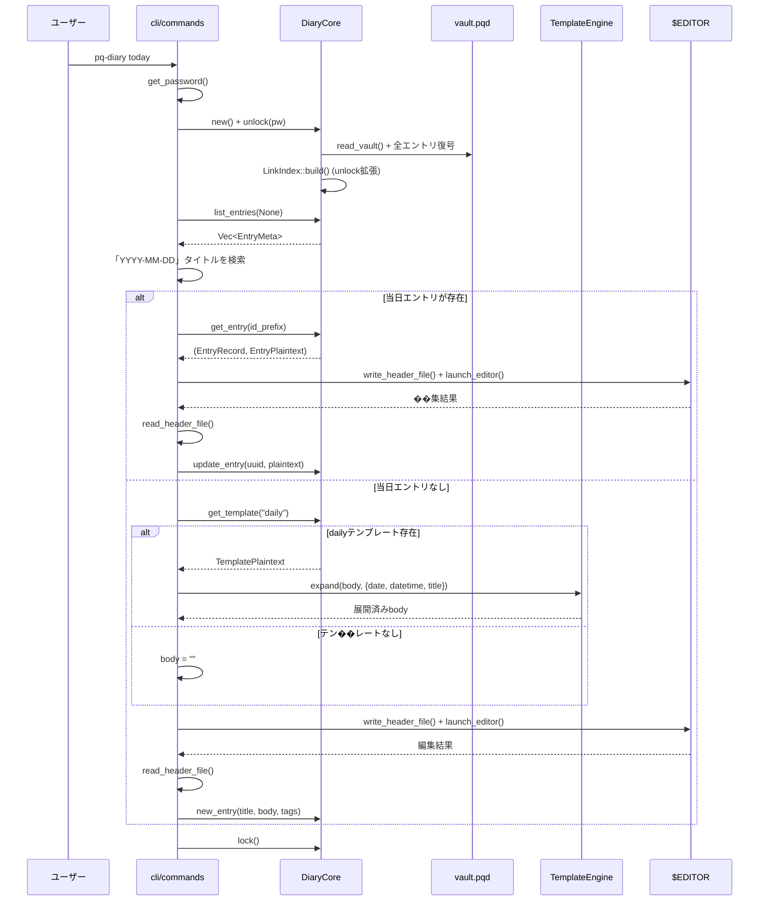
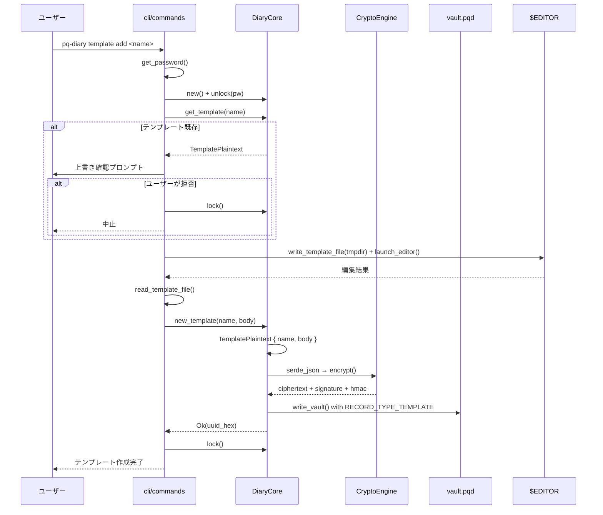
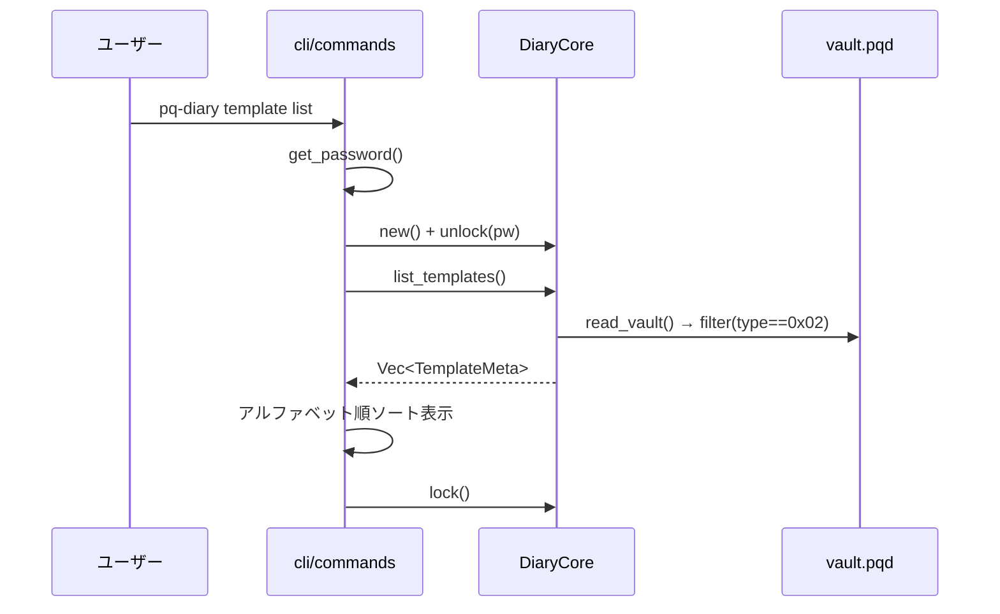
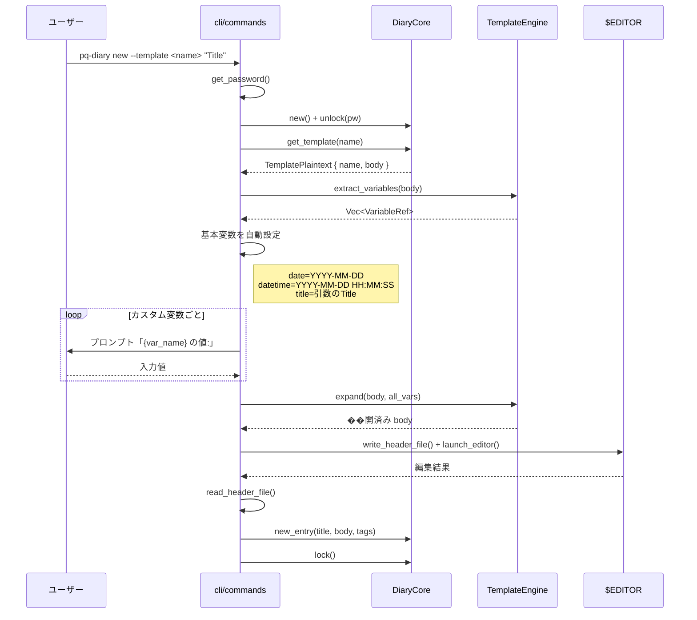
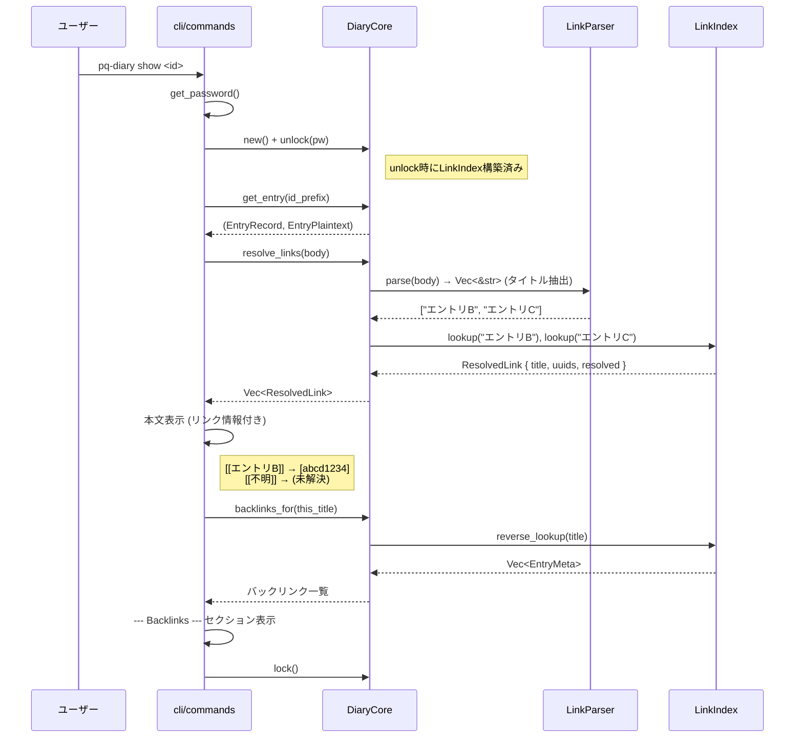
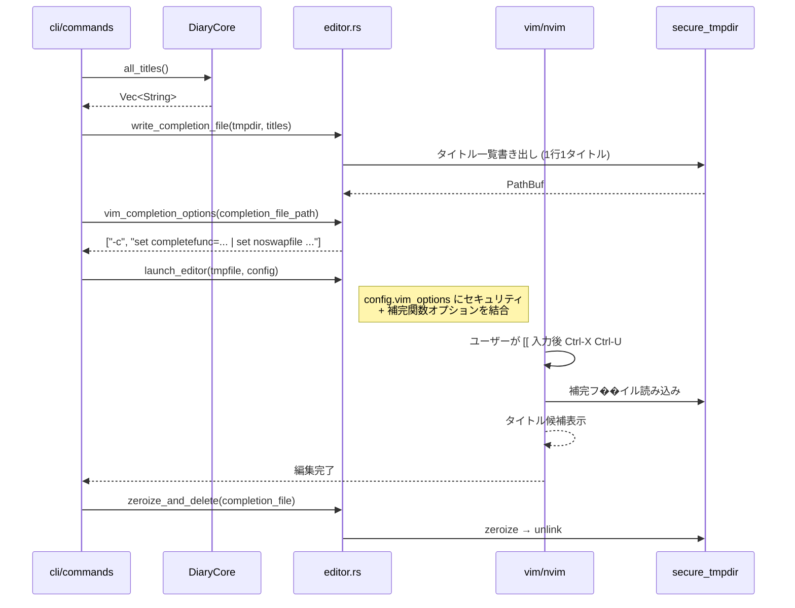

# daily-note-template-link データフロー図

**作成日**: 2026-04-05
**関連アーキテクチャ**: [architecture.md](architecture.md)
**関連要件定義**: [requirements.md](../../spec/daily-note-template-link/requirements.md)

**【信頼性レベル凡例】**:
- 🔵 **青信号**: EARS要件定義書・設計文書・ユーザヒアリングを参考にした確実なフロー
- 🟡 **黄信号**: EARS要件定義書・設計文書・ユーザヒアリングから妥当な推測によるフロー
- 🔴 **赤信号**: EARS要件定義書・設計文書・ユーザヒアリングにない推測によるフロー

---

## 1. today コマンドフロー 🔵

**信頼性**: 🔵 *REQ-001〜004・ヒアリングQ1, Q6より*



## 2. テンプレートCRUD フロー 🔵

**信頼性**: 🔵 *REQ-101〜105・ADR-0005より*

### template add



### template list / show / delete



## 3. new --template フロー 🔵

**信頼性**: 🔵 *REQ-111〜114・ヒアリングQ2, Q4より*



## 4. show コマンド（リンク解決 + バックリンク）フロー 🔵

**信頼性**: 🔵 *REQ-201〜211・ADR-0004・ヒアリングQ3, Q5より*



## 5. vim補完フロー 🔵

**信頼性**: 🔵 *ADR-0004・REQ-301〜303より*



### vim補完関数の詳細 🔵

**信頼性**: 🔵 *ADR-0004より*

エディタ起動時に注入する `-c` オプション:

```vim
" completefunc の設定 (Ctrl-X Ctrl-U でトリガー)
set completefunc=PqDiaryComplete

function! PqDiaryComplete(findstart, base)
  if a:findstart
    " カーソル位置から [[ を逆方向検索
    let line = getline('.')
    let start = col('.') - 1
    while start > 1 && line[start-2:start-1] != '[['
      let start -= 1
    endwhile
    return start
  else
    " 補完候補ファイルから読み込み
    let titles = readfile('{completion_file_path}')
    return filter(titles, 'v:val =~ "^" . a:base')
  endif
endfunction
```

## 6. LinkIndex 構築フロー（unlock拡張）🔵

**信頼性**: 🔵 *REQ-203・ヒアリングQ3より*

```mermaid
flowchart TD
    A[DiaryCore::unlock] --> B[既存: CryptoEngine初期化]
    B --> C[list_entries で全エントリ取得]
    C --> D[各エン���リの body を LinkParser でパース]
    D --> E{[[タイトル]] あり?}
    E -->|Yes| F[forward_map: タイトル → Vec UUID に追加]
    E -->|No| G[スキップ]
    F --> H[reverse_map: 被参照UUID → 参照元UUID に追加]
    G --> I[次のエントリ]
    H --> I
    I --> D
    D -->|全エントリ処理済み| J[LinkIndex { forward_map, reverse_map, title_map }]
    J --> K[self.link_index = Some に設定]
```

## エラーハンドリングフロー 🔵

**信頼性**: 🔵 *既存エラーパターンより*

```
DiaryError (thiserror)
├── TemplateNotFound(String)     # NEW: テンプレート名が見つからない
├── TemplateAlreadyExists(String) # NEW: 同名テンプレートが既に存在
├── InvalidTemplateName(String)   # NEW: テンプレート名バリデーション失敗
├── LinkResolutionError(String)   # NEW: リンク解決エラー
├── VaultNotFound                 # 既存
├── NotUnlocked                   # 既存
├��─ Entry(String)                 # 既存
├── Crypto(String)                # 既存
└── InvalidArgument(String)       # 既存
```

## 状態管理 🔵

**信頼性**: 🔵 *既存パターンより*

```
DiaryCore 状態遷移:
  Locked (engine=None, link_index=None)
    → unlock(pw)
  Unlocked (engine=Some, link_index=Some)
    → lock()
  Locked (engine=None, link_index=None, zeroized)
```

LinkIndex のライフサイクルは CryptoEngine と完全に同期。

## 関連文書

- **アーキテクチャ**: [architecture.md](architecture.md)
- **型定義**: [types.rs](types.rs)
- **要件定義**: [requirements.md](../../spec/daily-note-template-link/requirements.md)

## 信頼性レベルサマリー

- 🔵 青信号: 7件 (100%)
- 🟡 黄信号: 0件 (0%)
- 🔴 赤信号: 0件 (0%)

**品質評価**: 高品質
