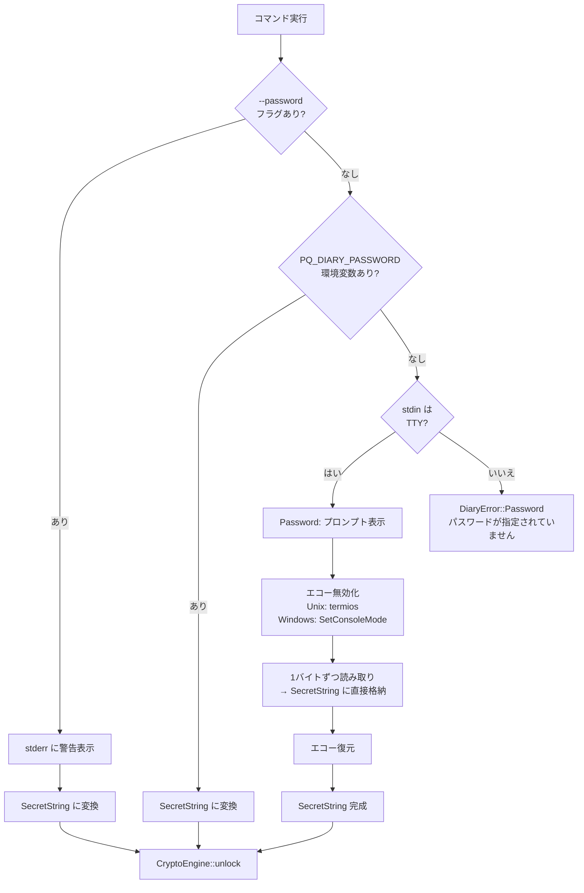
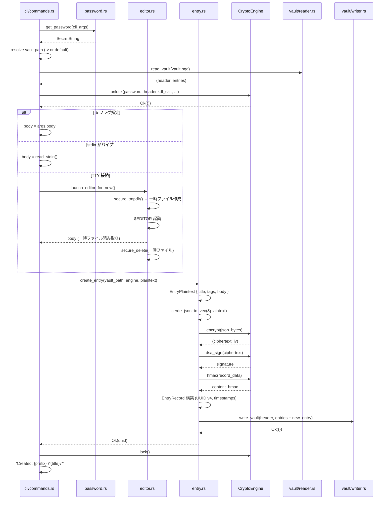
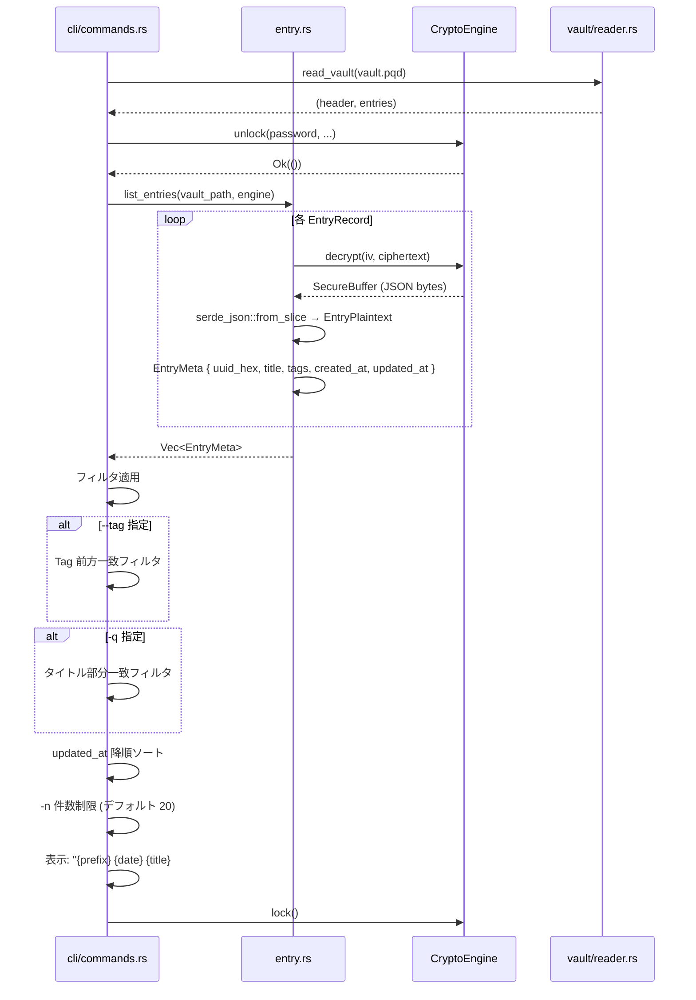
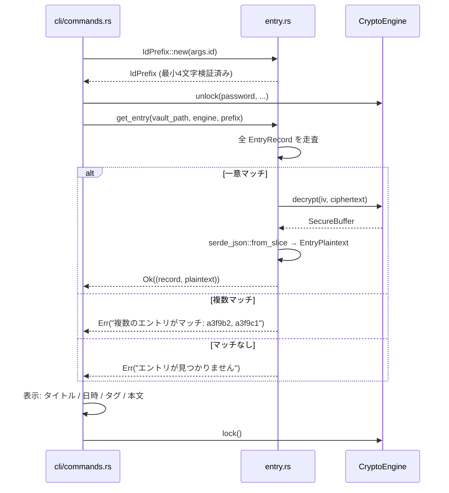
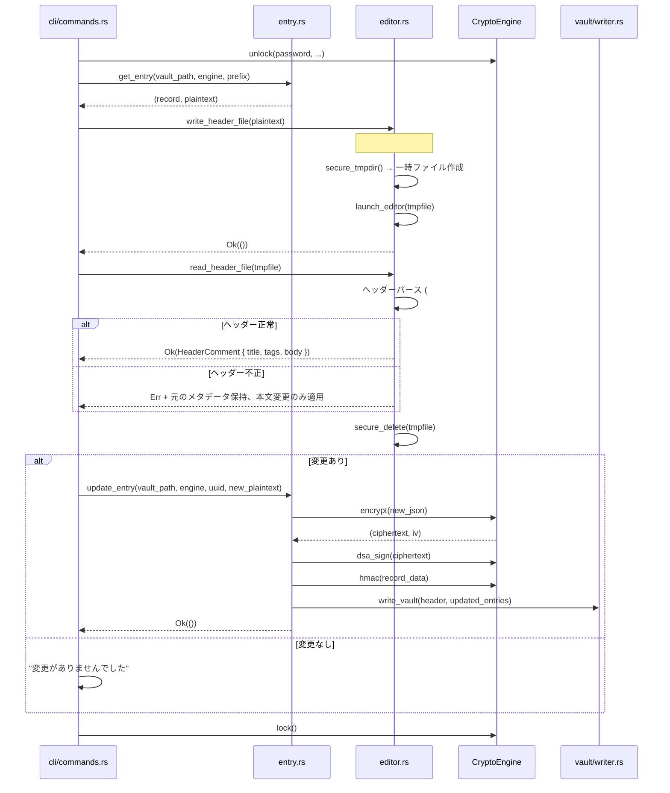
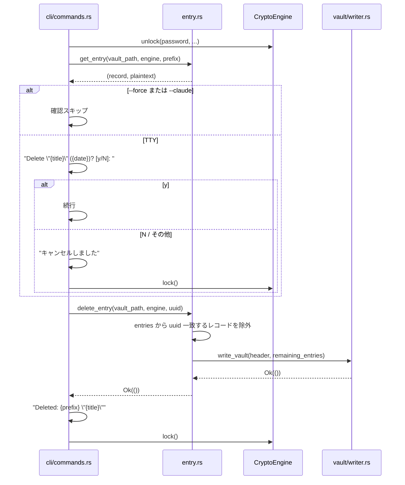
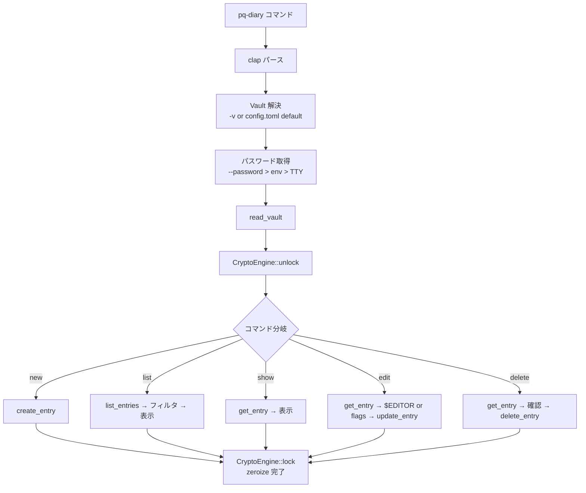

# S4: エントリ操作 + CLI — データフロー図

> **スプリント**: S4 (entry-ops-cli)
> **ステータス**: 全項目 DECIDED
> **関連アーキテクチャ**: [architecture.md](architecture.md)

---

## 1. パスワード取得フロー 🔵

*ADR-0003、要件 REQ-051〜REQ-054より*



---

## 2. エントリ作成フロー (new) 🔵

*要件 REQ-001, REQ-011〜REQ-013より*



---

## 3. エントリ一覧フロー (list) 🔵

*要件 REQ-002, REQ-031〜REQ-033より*



---

## 4. エントリ表示フロー (show) 🔵

*要件 REQ-003, REQ-041〜REQ-043より*



---

## 5. エントリ編集フロー (edit) 🔵

*要件 REQ-004, REQ-014〜REQ-016, REQ-082〜REQ-083より*

### 5.1 $EDITOR 経由 (フラグなし)



### 5.2 CLI フラグ経由 (--title / --add-tag / --remove-tag)

```mermaid
flowchart TD
    START[edit a3f9 --title "新名" --add-tag "新タグ"] --> UNLOCK[unlock]
    UNLOCK --> GET[get_entry by prefix]
    GET --> MODIFY[メタデータ更新<br/>title / tags 変更]
    MODIFY --> REENC[再暗号化 + 再署名]
    REENC --> WRITE[write_vault]
    WRITE --> LOCK[lock]
```

$EDITOR を起動しない。メタデータのみ変更して再暗号化。

---

## 6. エントリ削除フロー (delete) 🔵

*要件 REQ-005, REQ-021〜REQ-022より*



---

## 7. $EDITOR 一時ファイル制御フロー 🔵

*要件 REQ-061〜REQ-065、PRD §4.3より*

```mermaid
flowchart TD
    subgraph "セキュア一時ディレクトリ選択"
        PLATFORM{プラットフォーム}
        PLATFORM -->|Unix| SHM{/dev/shm 存在?}
        SHM -->|はい| USE_SHM[/dev/shm]
        SHM -->|いいえ| RUN{/run/user/$UID 存在?}
        RUN -->|はい| USE_RUN[/run/user/$UID]
        RUN -->|いいえ| USE_TMP[/tmp + 警告表示]
        PLATFORM -->|Windows| USE_LOCAL[%LOCALAPPDATA%\pq-diary\tmp\]
        USE_LOCAL --> ACL[ACL: オーナーのみ RW]
    end

    subgraph "エディタ起動"
        TMPDIR[一時ファイル作成] --> EDITOR{$EDITOR 判定}
        EDITOR -->|vim/nvim| VIM["-c set noswapfile nobackup noundofile"]
        EDITOR -->|その他| OTHER[引数なし]
        VIM --> ENV_SET["$TMPDIR/$TEMP/$TMP = セキュアディレクトリ"]
        OTHER --> ENV_SET
        ENV_SET --> LAUNCH[エディタ起動]
    end

    subgraph "後処理"
        LAUNCH --> EXIT{終了コード}
        EXIT -->|0| READ_FILE[一時ファイル読み取り]
        EXIT -->|非0| ABORT[編集破棄]
        READ_FILE --> ZEROIZE[ランダムデータ上書き]
        ABORT --> ZEROIZE
        ZEROIZE --> DELETE[ファイル削除]
    end
```

---

## 8. タグフィルタリングフロー 🔵

*要件 REQ-071〜REQ-073より*

```mermaid
flowchart TD
    INPUT["--tag \"仕事\""] --> VALIDATE[Tag::new で正規化]
    VALIDATE --> FILTER[全エントリの tags を走査]

    FILTER --> ENTRY1["#仕事"]
    FILTER --> ENTRY2["#仕事/設計"]
    FILTER --> ENTRY3["#仕事/設計/レビュー"]
    FILTER --> ENTRY4["#日記"]
    FILTER --> ENTRY5["#日記/振り返り"]

    ENTRY1 -->|"仕事".starts_with("仕事")| MATCH1[✅ マッチ]
    ENTRY2 -->|"仕事/設計".starts_with("仕事")| MATCH2[✅ マッチ]
    ENTRY3 -->|"仕事/設計/レビュー".starts_with("仕事")| MATCH3[✅ マッチ]
    ENTRY4 -->|"日記".starts_with("仕事")| NOMATCH1[❌ 非マッチ]
    ENTRY5 -->|"日記/振り返り".starts_with("仕事")| NOMATCH2[❌ 非マッチ]
```

前方一致ロジック: `entry_tag == filter_tag || entry_tag.starts_with(&format!("{}/", filter_tag))`

`--tag "仕事"` は `#仕事` 自体と `#仕事/...` の子孫すべてにマッチする。`#仕事人` にはマッチしない（`/` 区切りを要求）。

---

## 9. 全体コマンド実行フロー 🔵

*全要件の統合フロー*



---

## 関連文書

- **アーキテクチャ**: [architecture.md](architecture.md)
- **型定義**: [types.rs](types.rs)
- **要件定義**: [requirements.md](../../spec/entry-ops-cli/requirements.md)
- **S3 データフロー**: [../s3-vault-storage/dataflow.md](../s3-vault-storage/dataflow.md)

## 信頼性レベルサマリー

- 🔵 青信号: 全フロー (100%)
- 🟡 黄信号: 0件
- 🔴 赤信号: 0件

**品質評価**: 高品質
