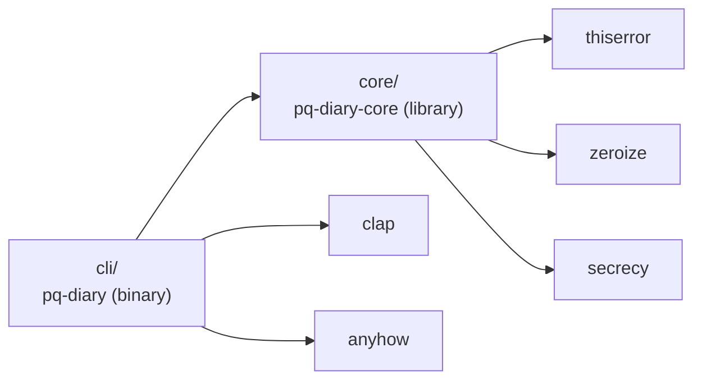
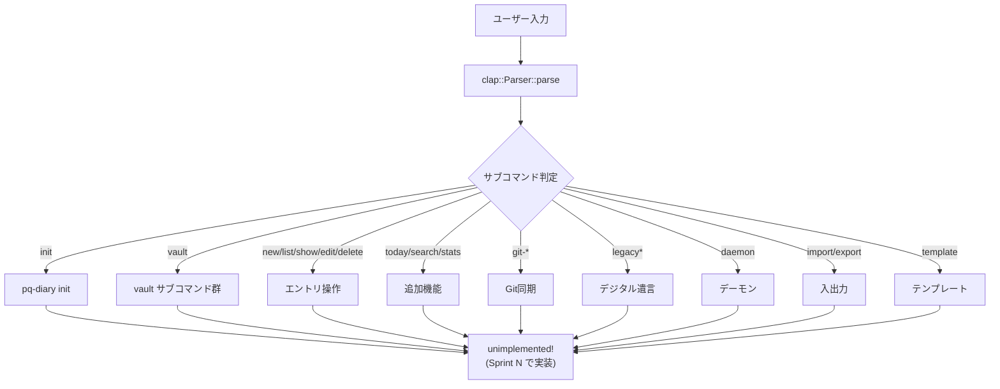
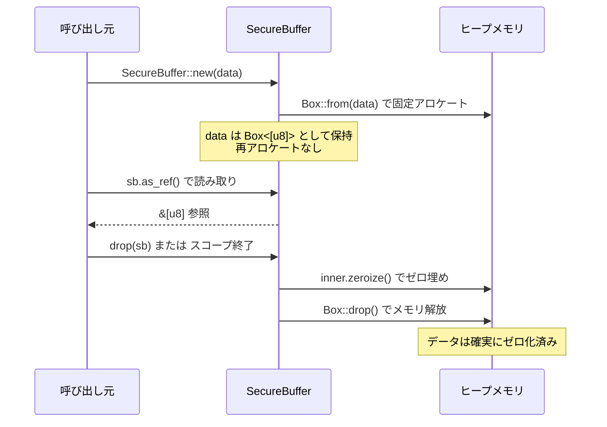
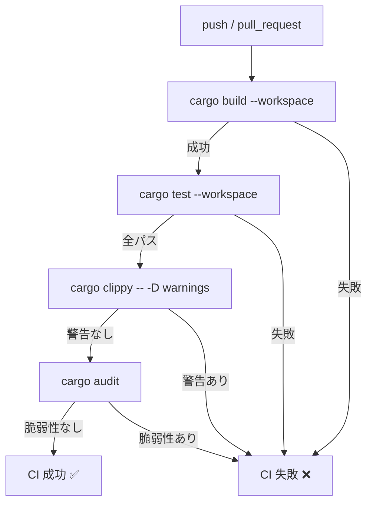

# s1-foundation データフロー図

**作成日**: 2026-04-03
**関連アーキテクチャ**: [architecture.md](architecture.md)
**関連要件定義**: [requirements.md](../../spec/s1-foundation/requirements.md)

**【信頼性レベル凡例】**:
- 🔵 **青信号**: EARS要件定義書・PRD・ユーザヒアリングを参考にした確実なフロー
- 🟡 **黄信号**: 妥当な推測によるフロー
- 🔴 **赤信号**: 推測によるフロー

---

## クレート間の依存フロー 🔵

**信頼性**: 🔵 *PRDセクション2.1より*



## CLI コマンドディスパッチフロー 🔵

**信頼性**: 🔵 *PRDセクション4.1・REQ-004より*



Sprint 1 では全コマンドが `unimplemented!` を返す。実装は各Sprintで埋める。

## SecureBuffer ライフサイクルフロー 🔵

**信頼性**: 🔵 *PRDセクション8.1-8.2・REQ-003・ヒアリングQ2より*



## CryptoEngine 状態遷移 🔵

**信頼性**: 🔵 *PRDセクション1.3・8.1-8.2・REQ-003・EDGE-103より*

```mermaid
stateDiagram-v2
    [*] --> Locked: CryptoEngine::new()
    Locked --> Unlocked: unlock(password)
    Unlocked --> Locked: lock()
    Locked --> [*]: drop()
    Unlocked --> [*]: drop()

    note right of Locked
        master_key: None
        legacy_key: None
        全暗号操作 → DiaryError::NotUnlocked
    end note

    note right of Unlocked
        master_key: Some(Secret<MasterKey>)
        legacy_key: Option<Secret<[u8; 32]>>
        暗号操作が可能
    end note
```

Sprint 1 では unlock/lock の中身は未実装（S2 で暗号実装を追加）。型定義と状態遷移のスケルトンのみ。

## DiaryError フロー 🔵

**信頼性**: 🔵 *REQ-002・REQ-403・EDGE-001-002より*

```mermaid
flowchart LR
    IO_ERR[std::io::Error] -->|#[from]| DIARY_ERR[DiaryError::Io]
    TOML_ERR[toml::de::Error] -->|#[from]| DIARY_ERR2[DiaryError::Config]
    CUSTOM["カスタムエラー"] --> DIARY_ERR3[DiaryError::Vault 等]

    subgraph core/
        DIARY_ERR --> RESULT["Result<T, DiaryError>"]
        DIARY_ERR2 --> RESULT
        DIARY_ERR3 --> RESULT
    end

    subgraph cli/
        RESULT -->|?| ANYHOW["anyhow::Result"]
        ANYHOW --> DISPLAY["stderr に Display 出力"]
    end
```

## CI パイプラインフロー 🔵

**信頼性**: 🔵 *REQ-005・REQ-101-102より*



## 関連文書

- **アーキテクチャ**: [architecture.md](architecture.md)
- **Rust型定義**: [types.rs](types.rs)
- **要件定義**: [requirements.md](../../spec/s1-foundation/requirements.md)

## 信頼性レベルサマリー

- 🔵 青信号: 6件 (100%)
- 🟡 黄信号: 0件 (0%)
- 🔴 赤信号: 0件 (0%)

**品質評価**: 最高品質
