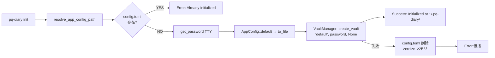
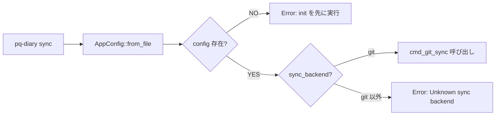
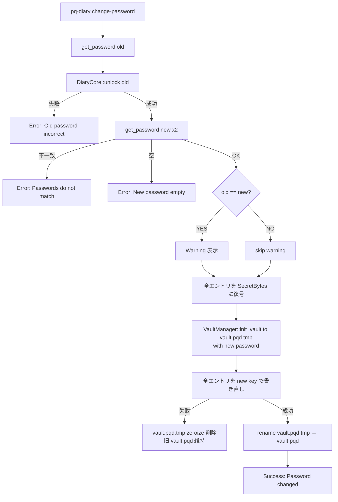
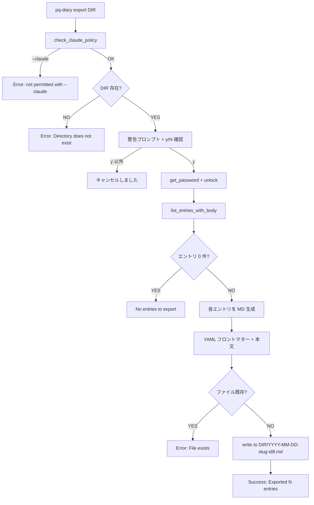
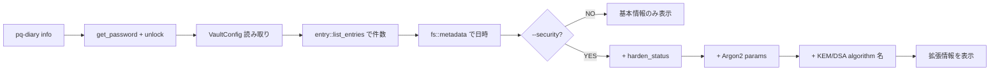

# S10 運用機能 + CLI整合性 アーキテクチャ設計

**作成日**: 2026-05-17
**関連要件定義**: [requirements.md](../../spec/s10-operations/requirements.md)
**ヒアリング記録**: [design-interview.md](design-interview.md)

**【信頼性レベル】**: 全項目🔵 (要件定義書 + ヒアリング 2026-05-17 確定提案 A〜J + 設計ヒアリング Q1〜Q3 + 既存実装パターンで確定済み)

---

## システム概要 🔵

S10 は Phase 1 で CLI スケルトンとしてのみ存在し未実装だった運用系コマンド (`init`, `sync`, `change-password`, `info`, `export`) を実装する。あわせて CLI ヘルプと実装の乖離を防ぐ DoD 強化と、未実装スケルトンの hide 化を行う。

**スコープ**: 既存の vault 暗号層 (S1-S3)、エントリ CRUD (S4)、policy (S7)、git 連携 (S8) の上に薄く乗る運用機能。新規の暗号アルゴリズムや vault フォーマット拡張は行わない。

## アーキテクチャパターン 🔵

**パターン**: 既存の **3 層アーキテクチャ** をそのまま踏襲。

```
┌─────────────────────────────────────────────────────────┐
│                  cli/ (バイナリ層)                       │
│  ┌──────────────────────────────────────────────────┐  │
│  │ main.rs: Commands enum + dispatch                │  │
│  │ commands.rs: cmd_init, cmd_sync, cmd_export,     │  │
│  │              cmd_change_password, cmd_info       │  │
│  │ security.rs: harden_process(), harden_status()   │  │
│  └──────────────────────────────────────────────────┘  │
└────────────────────────┬────────────────────────────────┘
                         │ pq-diary-core 公開 API
┌────────────────────────▼────────────────────────────────┐
│              core/ (pq-diary-core ライブラリ層)          │
│  ┌──────────────────────────────────────────────────┐  │
│  │ vault/config.rs: VaultConfig + AppConfig (新規)  │  │
│  │ vault/init.rs:   VaultManager (再利用)           │  │
│  │ entry.rs:        list/get/create/update/delete   │  │
│  │ lib.rs:          DiaryCore (再利用)              │  │
│  │ crypto/{kdf, aead, kem, dsa, secure_mem}         │  │
│  │ git.rs:          git_sync (再利用)               │  │
│  │ policy.rs:       OperationType (Export 追加検討) │  │
│  └──────────────────────────────────────────────────┘  │
└────────────────────────┬────────────────────────────────┘
                         │
┌────────────────────────▼────────────────────────────────┐
│               ストレージ層 (ファイルシステム)            │
│  ~/.pq-diary/                                           │
│  ├── config.toml          (AppConfig, S10 新規)         │
│  └── vaults/                                            │
│      └── default/                                       │
│          ├── vault.pqd    (暗号化バイナリ)              │
│          ├── vault.toml   (VaultConfig)                 │
│          └── entries/                                   │
└─────────────────────────────────────────────────────────┘
```

**選択理由**: 既存パターンが S1-S9 で確立されており、S10 は新機能追加のみで構造変更なし。

## コンポーネント構成

### 1. CLI 層 (`cli/`) 🔵

#### main.rs の変更点
- `Commands::Init` の `not_implemented` を `cmd_init()` 呼び出しに置換
- `Commands::Sync` の `not_implemented` を `cmd_sync()` 呼び出しに置換
- `Commands::Export` の `not_implemented` を `cmd_export()` 呼び出しに置換
- `Commands::ChangePassword` の `not_implemented` を `cmd_change_password()` 呼び出しに置換
- `Commands::Info` の `not_implemented` を `cmd_info()` 呼び出しに置換
- `Commands::Legacy` / `Commands::LegacyAccess` / `Commands::Daemon` に `#[command(hide = true)]` 追加
- `Commands::Export(ExportArgs { dir })` の引数構造追加

#### commands.rs 追加関数
- `cmd_init(cli: &Cli) -> anyhow::Result<()>`
- `cmd_sync(cli: &Cli) -> anyhow::Result<()>`
- `cmd_export(cli: &Cli, dir: PathBuf) -> anyhow::Result<()>`
- `cmd_change_password(cli: &Cli) -> anyhow::Result<()>`
- `cmd_info(cli: &Cli, security: bool) -> anyhow::Result<()>`
- ヘルパー: `resolve_app_config_path()` / `read_or_init_app_config()` / `slugify(title: &str) -> String`

#### security.rs 追加 API
- `pub fn harden_status() -> HardenStatus` — `info --security` から呼ぶ状態取得関数
- `pub struct HardenStatus { mlock_active: bool, coredump_disabled: bool, debugger_detected: bool }`
- `pub fn check_debugger_bool() -> bool` — `check_debugger()` の bool 返却版 (既存関数は警告出力のため別途用意)

### 2. core/ ライブラリ層 🔵

#### vault/config.rs 追加
- `pub struct AppConfig { app: AppSection }`
- `pub struct AppSection { default_vault: String, sync_backend: String }`
- `impl AppConfig { fn default_path() -> Result<PathBuf, DiaryError>, fn from_file(path: &Path) -> Result<Self, DiaryError>, fn to_file(&self, path: &Path) -> Result<(), DiaryError> }`
- `impl Default for AppConfig { default_vault = "default", sync_backend = "git" }`

#### vault/init.rs (再利用、変更なし)
- `VaultManager::create_vault` を `cmd_init` から呼び出し

#### lib.rs (DiaryCore 拡張または利用)
- 既存 `DiaryCore::unlock()` + `entry::list_entries_with_body()` を利用 (change-password / export)
- 新規 API は最小限。可能なら commands.rs 内で完結

#### error.rs DiaryError バリアント追加候補
- `DiaryError::Config(String)` — 既存 (Invalid config.toml で利用)
- `DiaryError::Password(String)` — 既存 (Empty password で利用)
- `DiaryError::Vault(String)` — 既存 (Already initialized で利用)
- **新規追加検討**: なし。既存バリアントで十分

### 3. 依存追加 🔵

- **`dirs = "5"`** (or 最新メジャー版): `dirs::home_dir()` で `~/.pq-diary/` 解決。`cli/Cargo.toml` に追加
- **`serde_yaml` 追加なし**: YAML フロントマターは手書き (30 行以下、固定フィールド)

## システム構成図

### init コマンドのフロー 🔵



### sync コマンドのフロー 🔵



### change-password のフロー 🔵



### export のフロー 🔵



### info / info --security のフロー 🔵



## ディレクトリ構造 🔵

S10 で変更/追加するファイル:

```
pq-diary/
├── Cargo.toml                          # (変更なし)
├── cli/
│   ├── Cargo.toml                      # [変更] dirs クレート追加
│   └── src/
│       ├── main.rs                     # [変更] dispatch 切り替え, hide 化
│       ├── commands.rs                 # [変更] cmd_init, cmd_sync, cmd_export, cmd_change_password, cmd_info 追加
│       └── security.rs                 # [変更] harden_status() 追加
├── core/
│   └── src/
│       └── vault/
│           └── config.rs               # [変更] AppConfig + AppSection 追加
├── docs/
│   ├── definition-of-done.md           # [変更] CLI 整合性セクション追加
│   └── implements/s10-operations/      # [生成] TDD サイクル出力
└── ci/
    └── smoke-test.sh (または .ps1)     # [新規] CLI smoke test スクリプト
```

## 非機能要件の実現方法

### パフォーマンス 🔵

- **NFR-001 (init < 3秒)**: Argon2id memory_cost_kb=65536/time_cost=3 = 1〜3秒 + ファイル書き込み数 ms。確実に達成。
- **NFR-002 (info < 100ms)**: 既存 list と同じ復号パス。ヘッダー復号 + エントリリスト走査のみ。
- **NFR-003 (change-password < 30秒 / 100エントリ・1KB)**: Argon2id 1〜3秒 (旧鍵) + 1〜3秒 (新鍵) + 100KB の AES-GCM 暗号化/復号 (<100ms) + ファイル書き込み (<1秒) = 計 5〜10秒。十分余裕。
- **NFR-004 (export < 10秒 / 1000エントリ・1KB)**: Argon2id 1〜3秒 + 1MB の AES-GCM 復号 (<100ms) + 1000 ファイル書き込み (1〜5秒) = 計 3〜8秒。

### セキュリティ 🔵

- **NFR-101 (メモリ保護)**: change-password で旧鍵・新鍵・全エントリ平文を `ZeroizingKey` / `SecretBytes` でラップ。Drop で zeroize。
- **NFR-102 (export 平文警告)**: REQ-504 で明示的プロンプト。
- **NFR-103 (--claude ブロック)**: `check_claude_policy` の前段で export / change-password を完全拒否。
- **NFR-104 (info --security 正確性)**: `harden_status()` で実プロセス状態を読む (ハードコード禁止)。
- **NFR-105 (vault.pqd.tmp zeroize)**: failure path で必ず tmp を zeroize 削除。

### ユーザビリティ 🔵

- **NFR-201 (init 一発起動)**: 引数ゼロ、対話 (パスワード入力) のみ。
- **NFR-202 (info 出力スタイル統一)**: `=== Vault Info ===` ヘッダー + `Label:    value` 左寄せ (stats と統一)。
- **NFR-203 (新パスワード 2 回入力)**: TTY プロンプト 2 回、不一致時は再要求せずエラー。

## 技術的制約

### パフォーマンス制約 🔵

- Argon2id パラメータ (memory_cost_kb=65536) はメモリ 64MB 必要。低スペック環境で要注意 (S2 確定事項)。

### セキュリティ制約 🔵

- `unsafe` 追加禁止 (S10 では security.rs の既存 unsafe のみ使用)。
- export で書き出した平文ファイルは zeroize 対象外 (ユーザー責任)。

### 互換性制約 🔵

- `dirs` クレート: Unix/macOS/Windows 全対応 (採用根拠の主要因)。
- TOML 形式: 既存 `toml` クレート (workspace 共通) を流用。
- vault.pqd フォーマット: v4 を維持 (change-password で再書き出し時もスキーマ不変)。

## 既存実装との統合ポイント 🔵

| S10 機能 | 統合先 | 統合方法 |
|---|---|---|
| `cmd_init` | `VaultManager::create_vault` | 既存 API を直接呼ぶ。前段で `AppConfig::default().to_file()` |
| `cmd_sync` | `cmd_git_sync` (cli/src/commands.rs:2166) | AppConfig の sync_backend で分岐後、`cmd_git_sync(cli)` をそのまま呼ぶ |
| `cmd_change_password` | `VaultManager::init_vault`, `entry::list_entries_with_body`, `entry::create_entry` | tmp vault に init → 各エントリを再投入 |
| `cmd_export` | `DiaryCore::unlock`, `entry::list_entries_with_body` | 既存復号パスを利用、出力は手書き YAML |
| `cmd_info` | `DiaryCore::unlock`, `VaultConfig::from_file`, `entry::list_entries`, `harden_status()` | 既存 API + 新規状態取得 |
| `harden_status()` | `secure_mem` (mlock 状態), `nix::sys::resource::getrlimit`, `check_debugger` ロジック | S9 既存実装をリファクタ |

## 関連文書

- **データフロー**: [dataflow.md](dataflow.md) (Mermaid シーケンス図)
- **型定義**: [types.rs](types.rs) (AppConfig, ExportEntry, HardenStatus 等)
- **スキーマ**: [schema.md](schema.md) (AppConfig TOML スキーマ + vault.pqd フォーマット参照)
- **CLI 仕様**: [cli-commands.md](cli-commands.md) (clap 定義 + core 公開 API)
- **ヒアリング**: [design-interview.md](design-interview.md)
- **要件定義**: [requirements.md](../../spec/s10-operations/requirements.md)

## 信頼性レベルサマリー

- 🔵 青信号: 全項目 (100%)
- 🟡 黄信号: 0 件
- 🔴 赤信号: 0 件

**品質評価**: 最高品質。要件定義 + 設計ヒアリング + 既存実装の参照で全項目確定済み。
