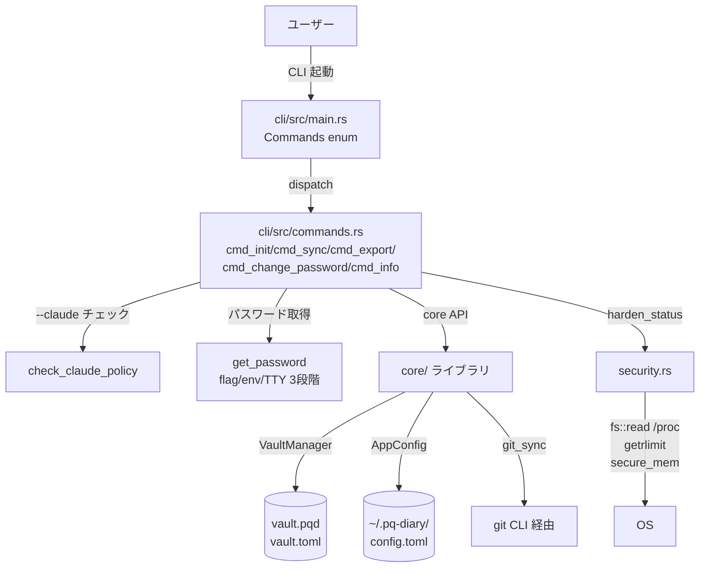
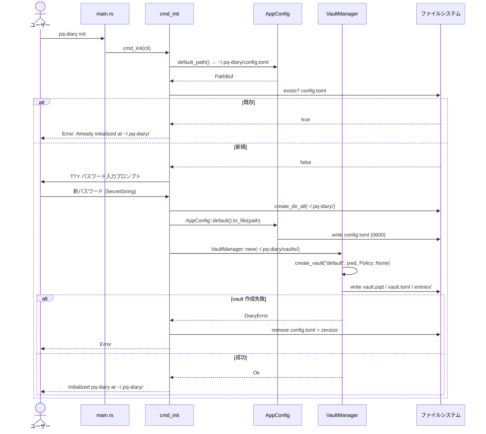
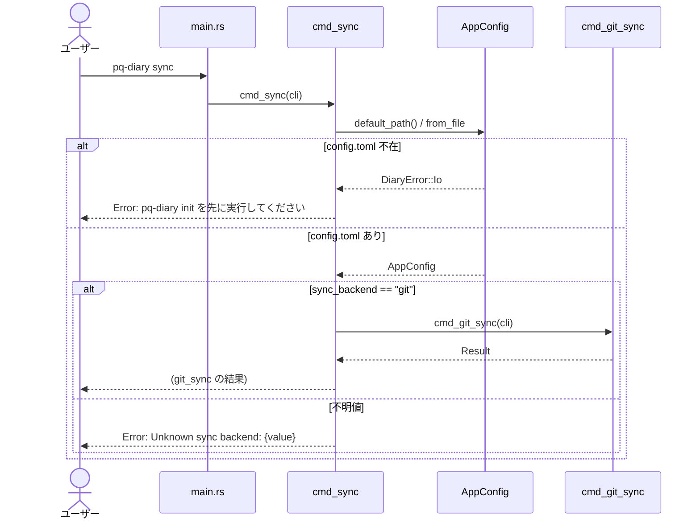
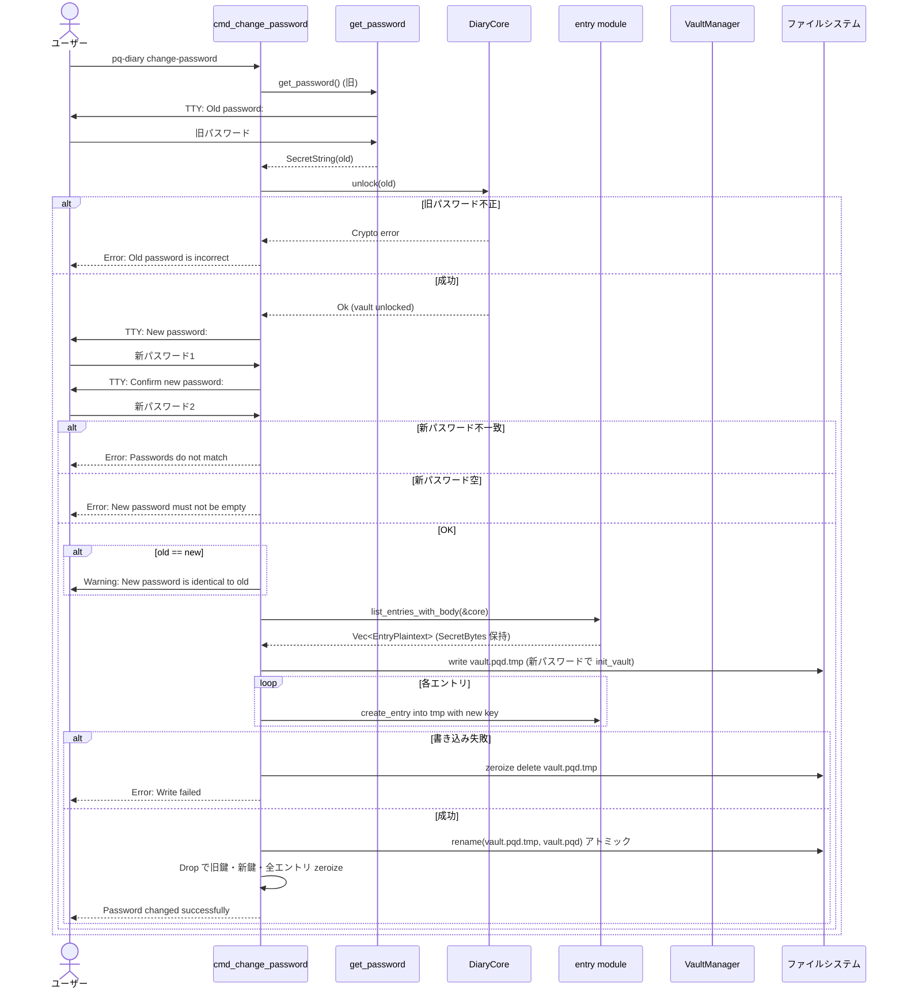
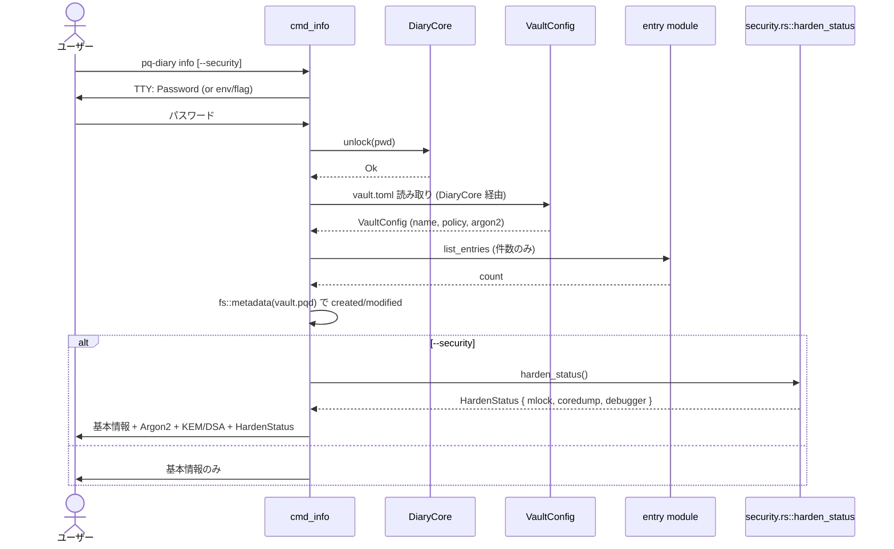
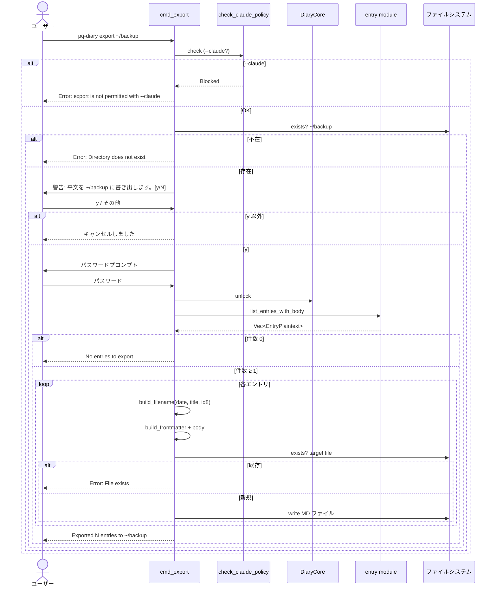
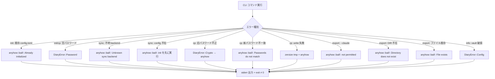
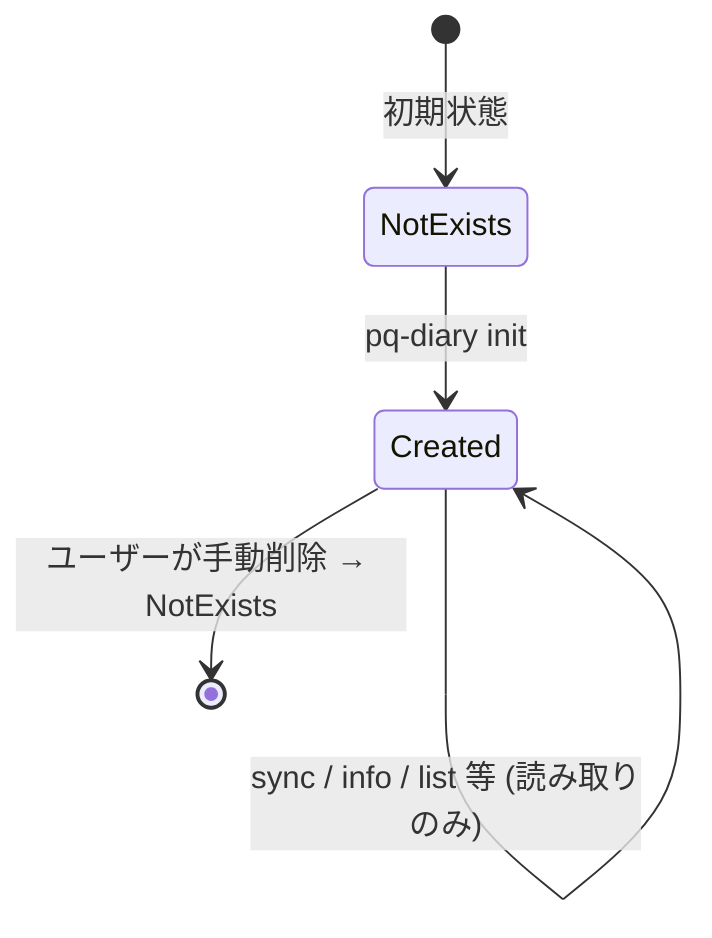
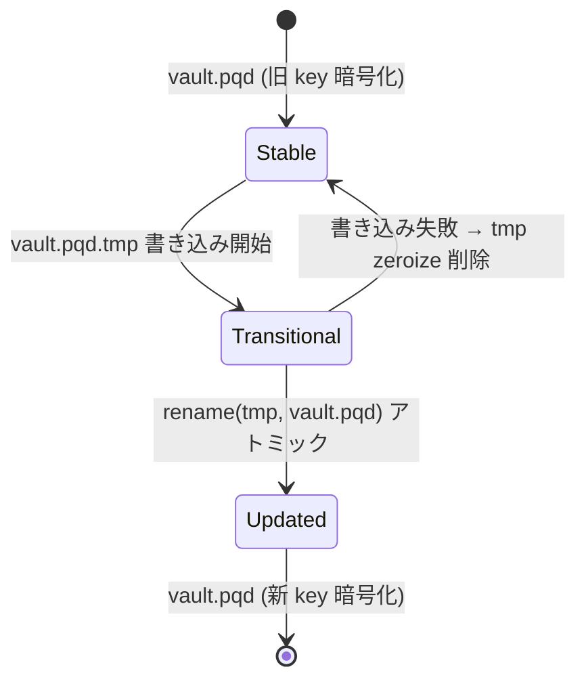

# S10 運用機能 + CLI整合性 データフロー図

**作成日**: 2026-05-17
**関連アーキテクチャ**: [architecture.md](architecture.md)
**関連要件定義**: [requirements.md](../../spec/s10-operations/requirements.md)

**【信頼性レベル】**: 全項目🔵 (要件定義 + 設計ヒアリング 2026-05-17 + 既存実装パターンで確定済み)

---

## システム全体のデータフロー 🔵



## 主要機能のデータフロー

### 機能 1: `pq-diary init` 🔵

**関連要件**: REQ-101 〜 REQ-112



### 機能 2: `pq-diary sync` 🔵

**関連要件**: REQ-201 〜 REQ-212



### 機能 3: `pq-diary change-password` 🔵 (最重要)

**関連要件**: REQ-301 〜 REQ-314



#### change-password メモリ管理 🔵

| ステップ | 保持データ | 型 / 保護 |
|---|---|---|
| 1. 旧パスワード受取 | `old_pwd` | `SecretString` (Drop で zeroize) |
| 2. 旧鍵導出 | `old_key` | `ZeroizingKey` |
| 3. 全エントリ復号 | `entries: Vec<EntryPlaintext>` | `EntryPlaintext` は `ZeroizeOnDrop` (S5 で実装済み) |
| 4. 新パスワード受取 | `new_pwd` | `SecretString` |
| 5. 新鍵導出 | `new_key` | `ZeroizingKey` |
| 6. tmp に書き出し | (上記すべてスコープ内) | スコープ離脱で全部 zeroize |
| 7. rename 後 | (空) | メモリクリア完了 |

### 機能 4: `pq-diary info` / `info --security` 🔵

**関連要件**: REQ-401 〜 REQ-412



#### info 出力例 (`--security` あり) 🔵

```
=== Vault Info ===
Name:           default
Policy:         none
Entries:        42
Created:        2026-04-15 09:23:11 UTC
Last updated:   2026-05-17 11:42:03 UTC

=== Security ===
KEM algorithm:        ML-KEM-768
Signature algorithm:  ML-DSA-65
Argon2 memory:        65536 KB
Argon2 time cost:     3
Argon2 parallelism:   1
mlock active:         yes
Coredump disabled:    yes
Debugger detected:    no
```

### 機能 5: `pq-diary export DIR` 🔵

**関連要件**: REQ-501 〜 REQ-521



#### export ファイル名生成ロジック 🔵

```
入力: created_date = 2026-05-17, title = "今日の出来事 #1", uuid = "3c6b775f-..."
処理:
  date_part = "2026-05-17"
  slug = slugify("今日の出来事 #1") = "今日の出来事-1"  (空白を - に、特殊文字を除去)
  id8 = "3c6b775f"
出力: "2026-05-17-今日の出来事-1-3c6b775f.md"

空タイトル時: slug = "untitled"
出力: "2026-05-17-untitled-3c6b775f.md"
```

#### export YAML フロントマター仕様 🔵

```markdown
---
id: 3c6b775f-4d8e-4c2b-9a1f-8d5e1f0a2b3c
title: "今日の出来事 #1"
tags:
  - test
  - smoke
created: 2026-05-17T09:23:11Z
updated: 2026-05-17T11:42:03Z
---

ここからエントリ本文
```

- YAML エスケープ: タイトルは常にダブルクォート括る + 内部の `"` と `\` をエスケープ
- tags が空の場合は `tags: []`
- 日時は ISO 8601 (RFC 3339) 形式、タイムゾーン UTC

## エラーハンドリングフロー 🔵



## 状態管理フロー 🔵

### AppConfig (config.toml) のライフサイクル



### change-password 中の vault.pqd 状態遷移



## データ整合性の保証 🔵

| 操作 | 保証手段 |
|---|---|
| AppConfig 書き込み | `.tmp + rename` (writer.rs の既存パターン踏襲) |
| vault.pqd 書き込み (change-password) | 全エントリ再暗号化を tmp に完了してから rename。中断時は旧 vault.pqd 維持 |
| export 出力ファイル | 既存ファイルは上書きせずエラー (REQ-EDGE-004) |
| init の部分作成 | vault 作成失敗時に config.toml と作成済みディレクトリを zeroize 削除 (REQ-112) |

## 関連文書

- **アーキテクチャ**: [architecture.md](architecture.md)
- **型定義**: [types.rs](types.rs)
- **スキーマ**: [schema.md](schema.md)
- **CLI 仕様**: [cli-commands.md](cli-commands.md)
- **要件定義**: [requirements.md](../../spec/s10-operations/requirements.md)

## 信頼性レベルサマリー

- 🔵 青信号: 全項目 (100%)
- 🟡 黄信号: 0 件
- 🔴 赤信号: 0 件

**品質評価**: 最高品質。全フローが要件定義 + 設計ヒアリング + 既存実装で確定済み。
