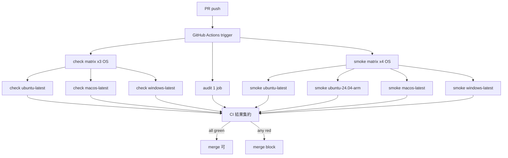

# S11 クロスプラットフォーム検証 + toolchain 固定 設計

**作成日**: 2026-05-17
**関連要件**: [requirements.md](../../spec/s11-crossplatform/requirements.md)
**信頼性レベル**: 全項目🔵

---

## システム概要

S11 は **CI ワークフロー再構成** が中心。Rust ソースコードの変更は「クロスプラットフォーム検証で発覚したバグの修正」のみ (条件付き)。新規モジュール、新規 API、新規型は追加しない。

## アーキテクチャ変更点

### Before (S10 hotfix 適用後)

```
.github/workflows/ci.yml
├── check          [ubuntu-latest 単独]
│   ├── cargo build --workspace --locked
│   ├── cargo test --workspace --locked
│   ├── cargo clippy --workspace --locked --all-targets -- -D warnings
│   ├── cargo install cargo-audit --locked
│   └── cargo audit
└── smoke          [ubuntu-latest, windows-latest]
    └── cargo build --release --workspace --locked → smoke-test.sh / .ps1
```

### After (S11 完了後)

```
rust-toolchain.toml             ← NEW (channel = "1.95.0", components = ["clippy","rustfmt"])

.github/workflows/ci.yml
├── check          [ubuntu-latest, macos-latest, windows-latest]   ← matrix 化
│   ├── cargo build --workspace --locked
│   ├── cargo test --workspace --locked
│   └── cargo clippy --workspace --locked --all-targets -- -D warnings
├── audit          [ubuntu-latest 単独]                            ← NEW (check から分離)
│   ├── cargo install cargo-audit --locked
│   └── cargo audit
└── smoke          [ubuntu-latest, ubuntu-24.04-arm, macos-latest, windows-latest]   ← 4 OS
    └── cargo build --release --workspace --locked → smoke-test.sh / .ps1
```

## ファイル設計

### 1. `rust-toolchain.toml` (新規) 🔵

リポジトリ root に配置。

```toml
[toolchain]
channel = "1.95.0"
components = ["clippy", "rustfmt"]
profile = "minimal"
```

- **channel**: 固定バージョン `"1.95.0"` (ヒアリング Q3 確定)
- **components**: CI と local で利用する clippy, rustfmt を明示
- **profile**: `minimal` で不要なコンポーネント (rust-docs, rust-analyzer 等) のダウンロードを避ける

### 2. `.github/workflows/ci.yml` (改訂)

#### check ジョブ (matrix 化)

```yaml
check:
  name: check
  strategy:
    fail-fast: false
    matrix:
      os: [ubuntu-latest, macos-latest, windows-latest]
  runs-on: ${{ matrix.os }}
  steps:
    - uses: actions/checkout@v4
    - uses: dtolnay/rust-toolchain@stable
    - uses: Swatinem/rust-cache@v2
    - run: cargo build --workspace --locked
    - run: cargo test --workspace --locked
    - run: cargo clippy --workspace --locked --all-targets -- -D warnings
```

- `dtolnay/rust-toolchain@stable` は残すが、`rust-toolchain.toml` の値が優先される (rustup 仕様)
- `Swatinem/rust-cache@v2` を維持してビルドキャッシュ活用

#### audit ジョブ (新規、check から分離)

```yaml
audit:
  name: audit
  runs-on: ubuntu-latest
  steps:
    - uses: actions/checkout@v4
    - uses: dtolnay/rust-toolchain@stable
    - uses: Swatinem/rust-cache@v2
    - run: cargo install cargo-audit --locked
    - run: cargo audit
```

- ubuntu のみで 1 回実行 (重複排除)
- 既存 `check` ジョブからは `cargo audit` 関連ステップを削除

#### smoke ジョブ (matrix 拡張)

```yaml
smoke:
  name: CLI smoke test
  strategy:
    fail-fast: false
    matrix:
      os: [ubuntu-latest, ubuntu-24.04-arm, macos-latest, windows-latest]
  runs-on: ${{ matrix.os }}
  steps:
    - uses: actions/checkout@v4
    - uses: dtolnay/rust-toolchain@stable
    - uses: Swatinem/rust-cache@v2
    - name: Build release binary
      run: cargo build --release --workspace --locked
    - name: CLI smoke test (Unix-like)
      if: runner.os != 'Windows'
      shell: bash
      run: |
        chmod +x ./ci/smoke-test.sh
        ./ci/smoke-test.sh ./target/release/pq-diary
    - name: CLI smoke test (Windows)
      if: runner.os == 'Windows'
      shell: pwsh
      run: ./ci/smoke-test.ps1 -Bin ./target/release/pq-diary.exe
```

- `runner.os` 値は: ubuntu (Linux) / macos (macOS) / windows (Windows)
- `if: runner.os != 'Windows'` で Unix-like (Linux + macOS) は bash、Windows は PowerShell
- `ubuntu-24.04-arm` も `runner.os == 'Linux'` 扱い → bash 版が走る

### 3. `docs/backlog.md` (更新)

S9 セクションの「クロスプラットフォームビルド」を `[x]` に変更:

```diff
- [ ] クロスプラットフォームビルド (Linux x86_64/aarch64, macOS aarch64, Windows x86_64) — Windows確認済、Linux/macOSは未確認
+ [x] クロスプラットフォームビルド (Linux x86_64/aarch64, macOS aarch64, Windows x86_64) — S11 で CI matrix 化により完了
```

S11 セクションを末尾に追加 (S10 と同じスタイル)。

## データフロー



合計 **8 並列ジョブ** (check 3 + audit 1 + smoke 4)。fail-fast: false により 1 つ失敗しても他は最後まで走る。

## 既存実装との統合ポイント

| S11 変更 | 影響先 | 統合方法 |
|---|---|---|
| `rust-toolchain.toml` 追加 | local cargo, CI rustup | rustup が自動検出 (action 不要) |
| `check` ジョブ matrix 化 | 既存 ubuntu check 設定 | matrix セクション追加 + runs-on を `${{ matrix.os }}` に |
| `audit` ジョブ分離 | 既存 check 内の audit ステップ | check から削除、新ジョブを追加 |
| `smoke` ジョブ拡張 | 既存 matrix.os | 配列に 2 OS 追加 |

## 期待される CI 実行時間

| ジョブ | 並列度 | 想定時間 |
|---|---|---|
| check (3 OS 並列) | 3 | 4〜6 分 (最遅 OS) |
| audit | 1 | 20〜40 秒 |
| smoke (4 OS 並列) | 4 | 1〜2 分 (最遅 OS) |
| **合計 (全並列)** | - | **〜6 分** (NFR-001 達成) |

## 非機能要件の充足

| NFR | 設計上の充足策 |
|---|---|
| NFR-001 (CI < 10 分) | 全 8 ジョブ並列 + Swatinem cache で達成 |
| NFR-002 (audit < 30 秒) | cargo-audit インストールキャッシュ + DB fetch のみ |
| NFR-101 (toolchain は audit 通過版) | 1.95.0 stable は 2026-05 現在で audit clean (S10 hotfix で確認済み) |
| NFR-201 (失敗の可視性) | ジョブ名 `check (ubuntu-latest)` 等で OS 明示 |
| NFR-202 (toolchain 変更時の説明) | rust-toolchain.toml 更新の PR 説明欄に理由記載 (運用ルール) |

## エラーフロー

| 失敗箇所 | 対応 |
|---|---|
| `cargo build` failure (任意 OS) | OS 固有問題として REQ-601 で修正タスク追加 or 繰り越し |
| `cargo test` failure | 同上 |
| `cargo clippy` failure | toolchain pin により再現性確保、即修正 |
| `cargo audit` failure | RUSTSEC 警告 → 依存更新 or `cargo audit --ignore RUSTSEC-XXXX` で許容 |
| `smoke-test.sh` failure (Unix) | smoke test スクリプトのバグ or バイナリ動作不良として調査 |
| `ubuntu-24.04-arm` unavailable | matrix からエントリ削除して再 push (EDGE-001) |

## ロールバック戦略

S11 でいずれかの変更が問題を起こした場合:
- **rust-toolchain.toml 削除**: 1 コミットで rollback、CI は dtolnay の stable に戻る
- **matrix 化を元に戻す**: 1 コミットで rollback、check は ubuntu 単独に戻る
- **audit ジョブ分離を元に戻す**: マージ前ならコミット差し戻し、マージ後は revert PR

## 関連文書

- 要件定義: [requirements.md](../../spec/s11-crossplatform/requirements.md)
- ユーザストーリー: [user-stories.md](../../spec/s11-crossplatform/user-stories.md)
- 受け入れ基準: [acceptance-criteria.md](../../spec/s11-crossplatform/acceptance-criteria.md)
- 既存 CI: `.github/workflows/ci.yml`
- 参考: [S10 architecture](../../design/s10-operations/architecture.md), [S9 design](../../design/s9-security-hardening/architecture.md)

## 信頼性レベルサマリー

- 🔵 青信号: 全項目 (100%)
- 🟡 黄信号: 0
- 🔴 赤信号: 0

**品質評価**: 最高品質。
