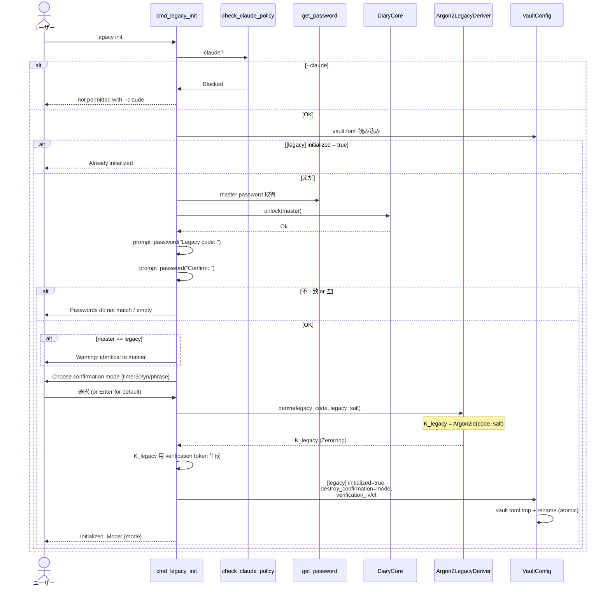
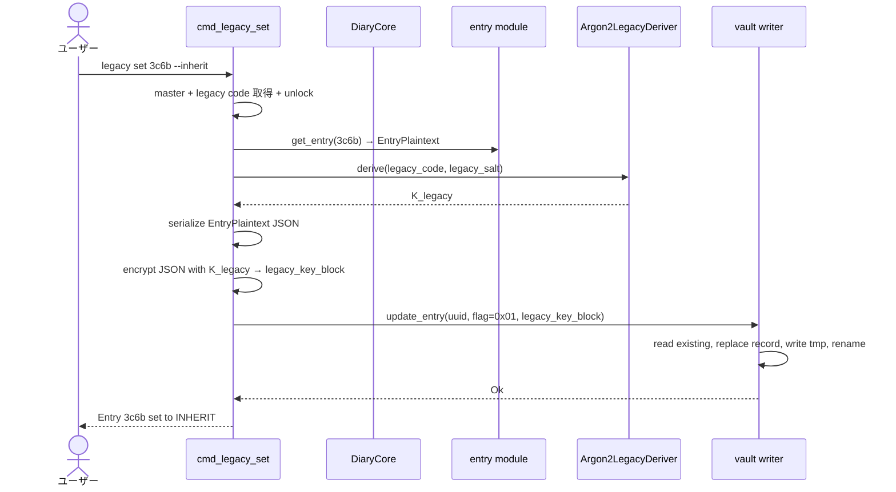
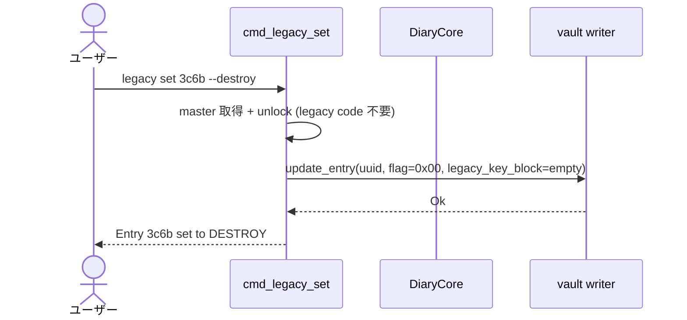
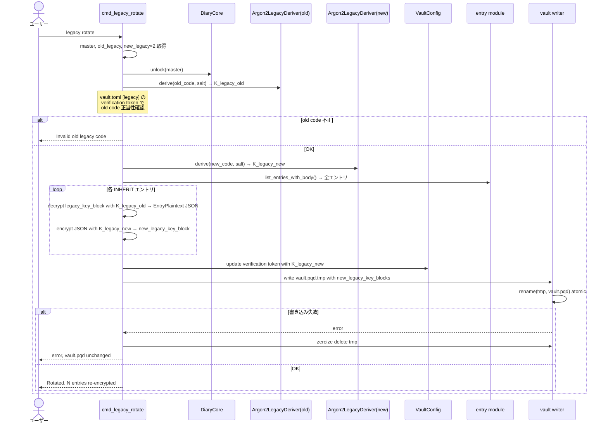
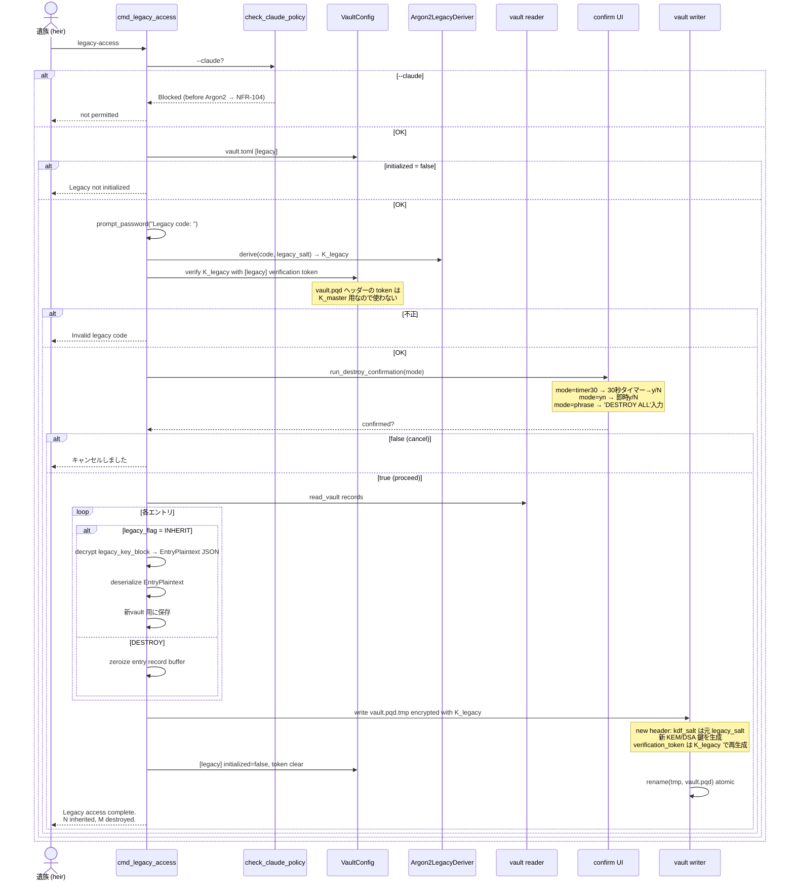
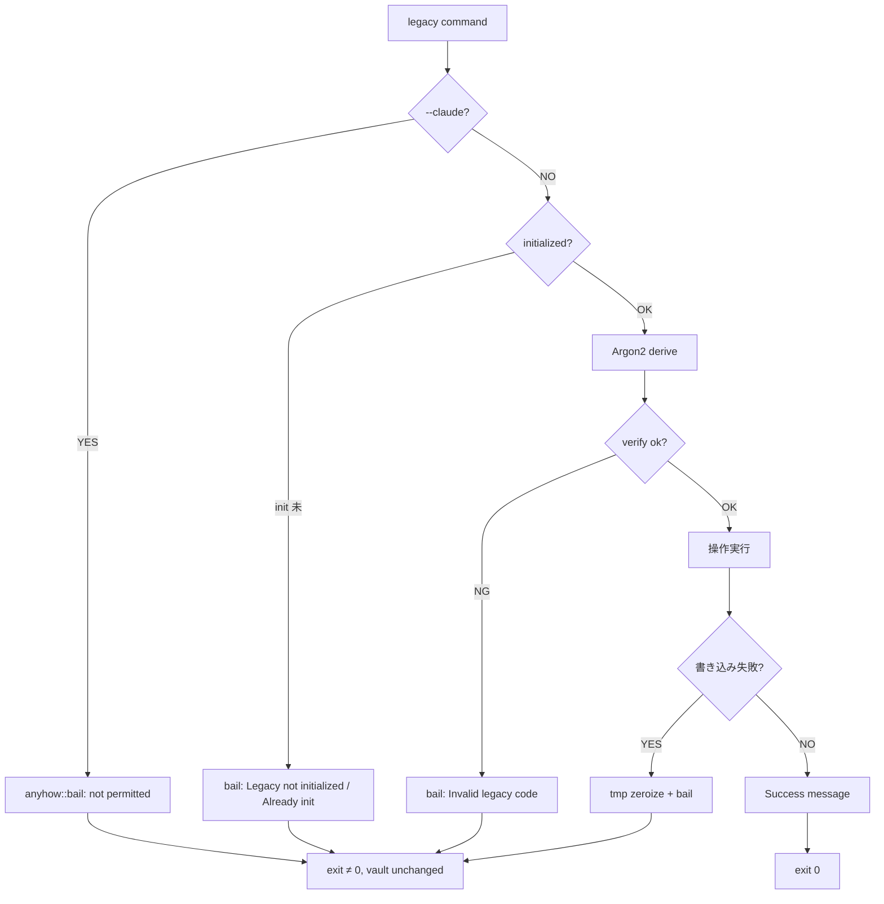

# S12 デジタル遺言 データフロー

**作成日**: 2026-05-17
**関連設計**: [architecture.md](architecture.md)

**【信頼性レベル】**: 全フロー🔵

---

## 1. `legacy init` フロー 🔵

## 2. `legacy set --inherit` フロー 🔵

## 3. `legacy set --destroy` フロー 🔵

## 4. `legacy rotate` フロー 🔵

## 5. `legacy-access` フロー (最重要、不可逆) 🔵

## メモリ管理 (legacy-access)

| ステップ | 保持データ | 保護 |
|---|---|---|
| 1. legacy code 受取 | `SecretString` | Drop で zeroize |
| 2. K_legacy 導出 | `Zeroizing<[u8; 32]>` | scope 抜けで zeroize |
| 3. 全 INHERIT 復号 | `Vec<EntryPlaintext>` | EntryPlaintext は ZeroizeOnDrop |
| 4. 新 vault.pqd 構築 | tmp ファイル | 失敗時 zeroize 上書き → delete |
| 5. rename 完了 | 関数 scope 抜け | 全 zeroize |

## エラーフロー (共通)

## vault.pqd 書き換え範囲 (各コマンド比較)

| コマンド | header | entry records |
|---|---|---|
| `legacy init` | (no change) | (no change) — vault.toml のみ更新 |
| `legacy set --inherit` | (no change) | 1 entry: flag 0x00→0x01, legacy_key_block 追加 |
| `legacy set --destroy` | (no change) | 1 entry: flag 0x01→0x00, legacy_key_block 削除 |
| `legacy rotate` | (no change) | 全 INHERIT: legacy_key_block 再暗号化 |
| `legacy-access` | kdf_salt = 元 legacy_salt、verification_token を K_legacy で再生成 | DESTROY 削除、INHERIT を K_legacy で再構築 |

## 関連

- [architecture.md](architecture.md)
- [types.rs](types.rs)
- [schema.md](schema.md)
- [cli-commands.md](cli-commands.md)
