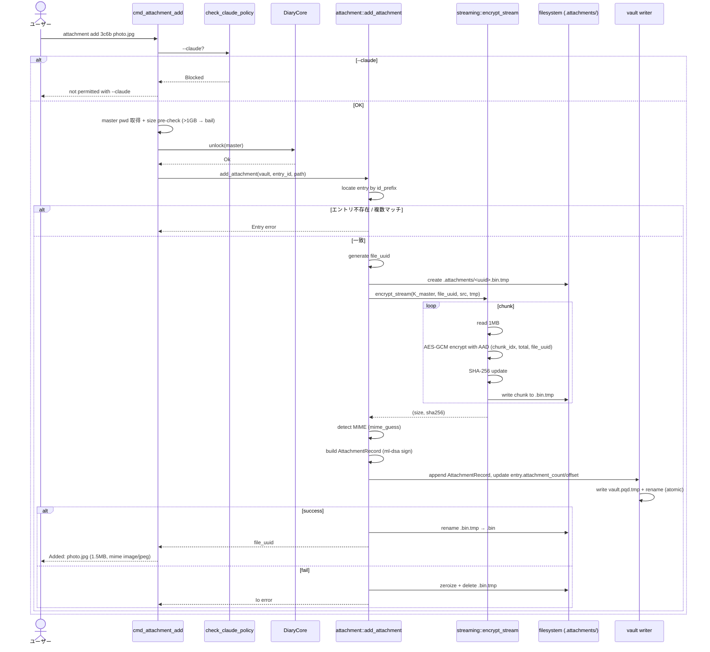
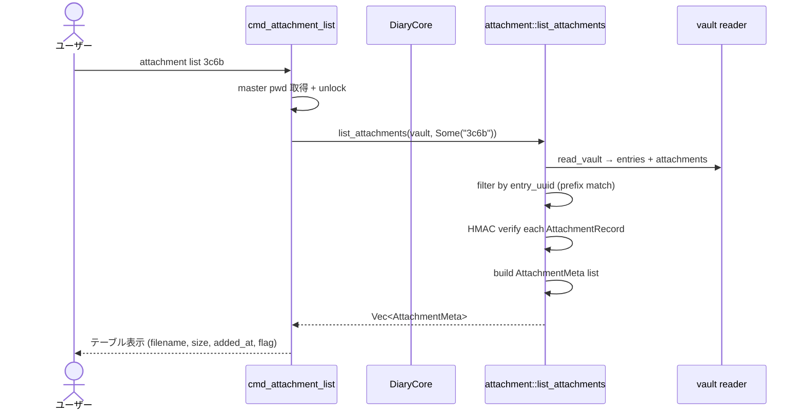
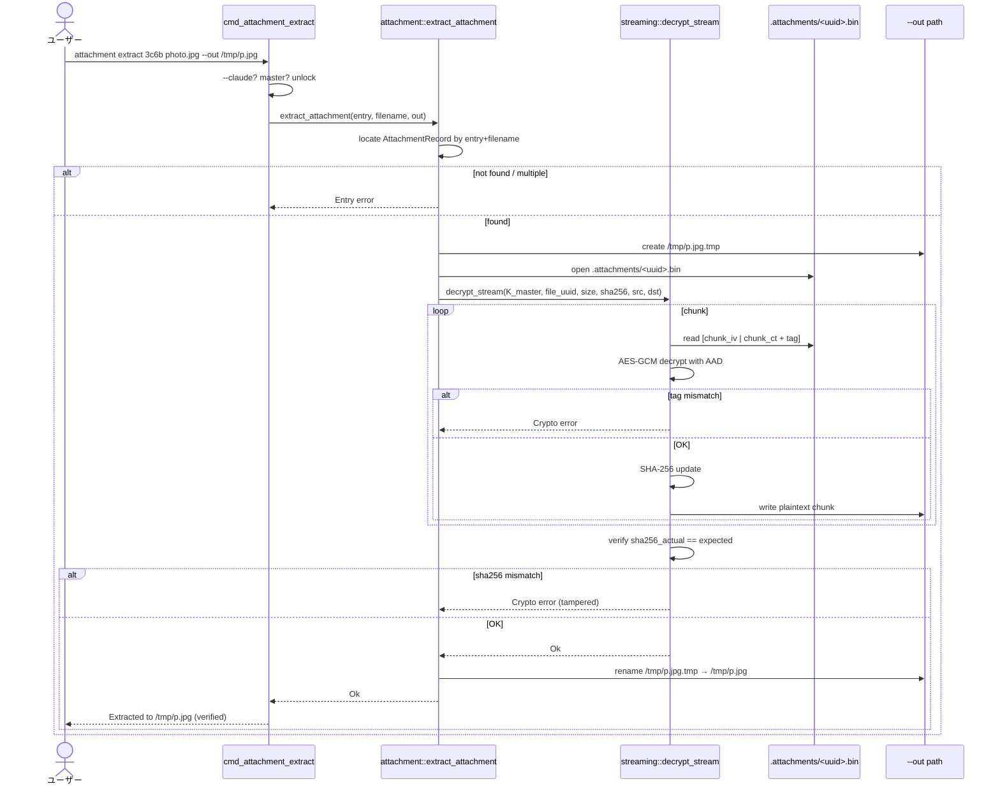
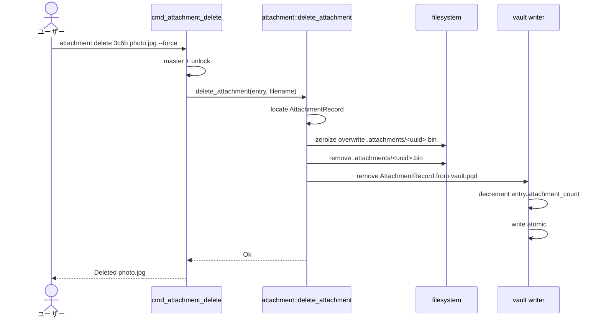
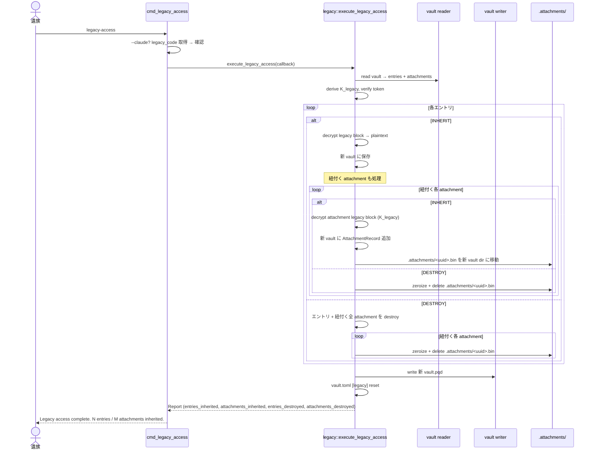
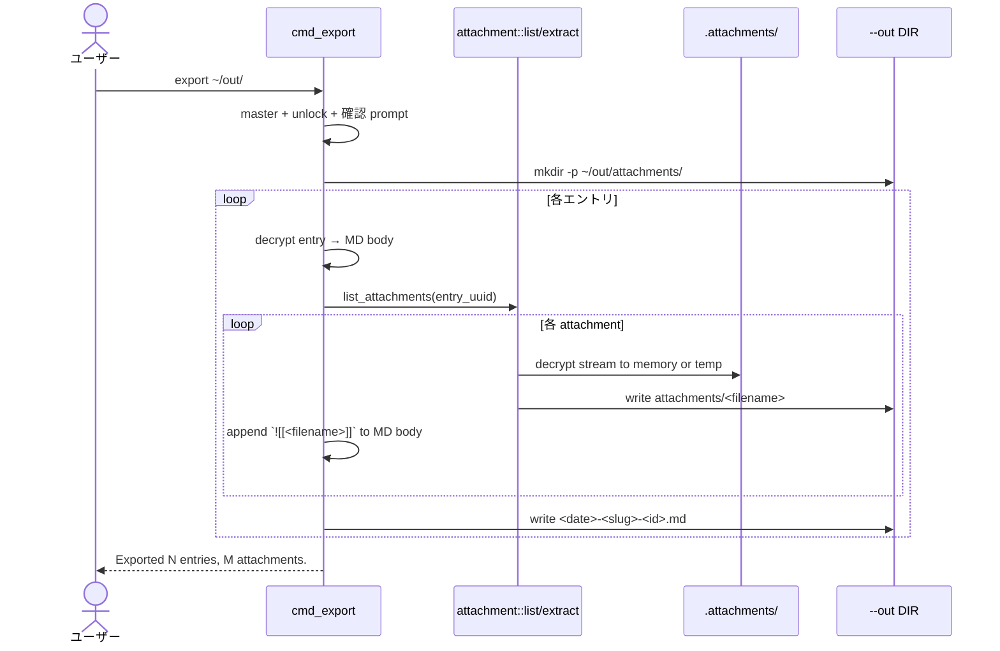
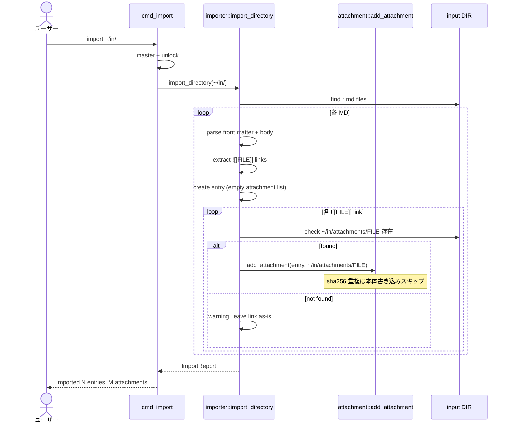
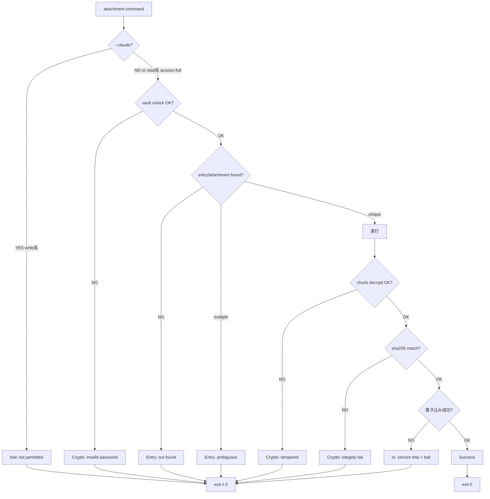

# S13 添付ファイル データフロー

**作成日**: 2026-05-18
**関連設計**: [architecture.md](architecture.md)

**【信頼性レベル】**: 全フロー 🟡 (架空コードベース、PRD §10 明示なし、設計判断)

---

## 1. `attachment add` フロー 🟡

## 2. `attachment list` フロー 🟡

## 3. `attachment extract` フロー 🟡

## 4. `attachment delete` フロー 🟡

## 5. `legacy-access` 拡張フロー 🟡

## 6. `export` 拡張フロー 🟡

## 7. `import` 拡張フロー 🟡

## メモリ管理 (attachment add / extract)

| ステップ | 保持データ | 保護 |
|---|---|---|
| chunk read | 1MB buffer | `Zeroizing<Vec<u8>>` |
| chunk encrypt | chunk_ct (1MB + 16B tag) | non-secret (out put), but Vec cleared on drop |
| chunk decrypt | chunk_plaintext (1MB) | `Zeroizing<Vec<u8>>` |
| sha256 hasher | Sha256 state | non-secret |
| K_master | 32B | SecretBox / ZeroizeOnDrop |
| File handles | Read/Write trait objects | Drop closes |

## エラーフロー (共通)

## vault.pqd 書き換え範囲 (各コマンド比較)

| コマンド | header | entry records | attachment records | .attachments/ |
|---|---|---|---|---|
| `attachment add` | (no change) | 1 entry: attachment_count++, attachment_offset 更新 | 1 record 追加 | 1 .bin 追加 |
| `attachment list` | (no change) | (no change) | (read) | (no change) |
| `attachment extract` | (no change) | (no change) | (read) | (read) |
| `attachment delete` | (no change) | 1 entry: attachment_count-- | 1 record 削除 | 1 .bin 削除 (zeroize) |
| `attachment set` | (no change) | (no change) | 1 record: legacy_flag / legacy_key_block | (no change) |
| `legacy-access` | 完全再構築 | INHERIT のみ保持 | INHERIT のみ保持 | DESTROY .bin 削除 |
| `change-password` | kdf_salt / verification 更新 | 全 re-encrypt | 全 re-encrypt | (no change, K_master 共用しない) |

## 関連

- [architecture.md](architecture.md)
- [types.rs](types.rs)
- [schema.md](schema.md)
- [cli-commands.md](cli-commands.md)
