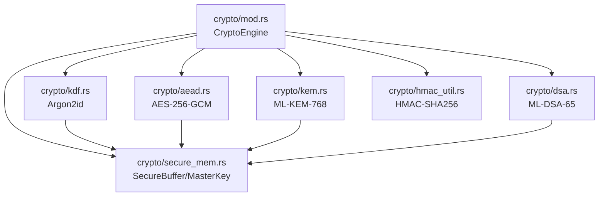
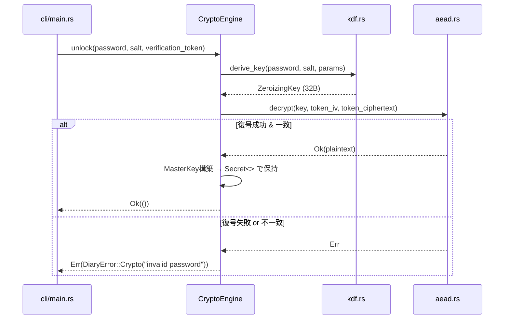
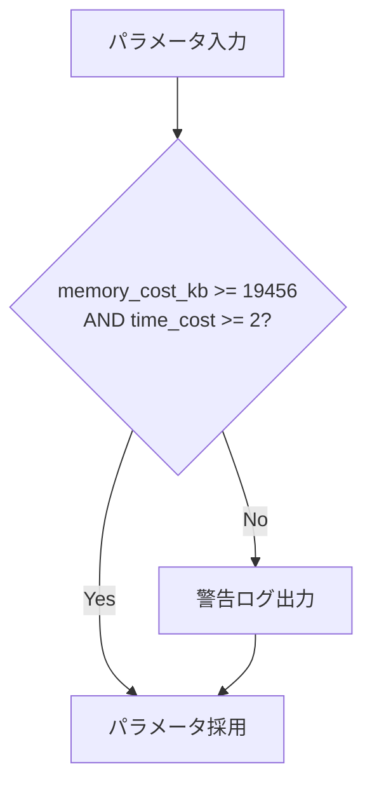

# データフロー図: s2-crypto-core

| 項目 | 値 |
|------|-----|
| 要件名 | s2-crypto-core (Sprint 2 — 暗号コア) |
| 日付 | 2026-04-03 |
| ステータス | 確定 |

---

## 1. 暗号モジュール依存関係図

crypto/mod.rs (CryptoEngine) を中心に、各サブモジュールがどのように依存しているかを示す。



**信頼性**: 🔵 確定

---

## 2. unlock フロー

パスワードからマスターキーを導出し、検証トークンで正当性を確認するフロー。



**補足**:
- Argon2idパラメータ: memory_cost_kb=65536, time_cost=3, parallelism=4
- 検証トークン: vault.pqdヘッダ内に格納された32バイト平文のAES-GCM暗号文
- 導出されたZeroizingKeyは検証成功後にMasterKeyのsym_keyとして保持される

**信頼性**: 🔵 確定

---

## 3. エントリ暗号化フロー

日記エントリを暗号化する際の全体的なデータフロー。

```mermaid
sequenceDiagram
    participant E as entry.rs
    participant CE as CryptoEngine
    participant AEAD as aead.rs
    participant KEM as kem.rs
    participant DSA as dsa.rs
    participant HMAC as hmac_util.rs

    E->>CE: encrypt_entry(plaintext)
    CE->>CE: K_entry = OsRng.gen::<[u8;32]>()
    CE->>AEAD: encrypt(K_entry, nonce, plaintext)
    AEAD-->>CE: ciphertext + GCM tag
    CE->>KEM: encapsulate(kem_pk) → K_entryを保護
    KEM-->>CE: (kem_ciphertext, shared_secret)
    CE->>DSA: sign(dsa_sk, ciphertext)
    DSA-->>CE: signature
    CE->>HMAC: hmac(K_entry, plaintext)
    HMAC-->>CE: content_hmac (32B)
    CE-->>E: EncryptedEntry { ciphertext, nonce, kem_ct, sig, hmac }
```

**補足**:
- K_entryはエントリごとにランダム生成される一時鍵（32バイト）
- Nonceは各暗号化操作でOsRngから12バイト生成（再利用禁止）
- GCM tagはciphertextに付加される（16バイト）
- KEM暗号文はK_entryの保護に使用
- DSA署名は暗号文の真正性を保証
- HMACは平文の完全性を保証（復号後に検証可能）

**信頼性**: 🔵 確定

---

## 4. Argon2id パラメータ検証フロー

Argon2idのパラメータが最低保証値を満たしているかを検証するフロー。



**補足**:
- デフォルト値: memory_cost_kb=65536, time_cost=3, parallelism=4
- 最低保証値を下回ってもエラーにはせず、警告ログを出力した上でパラメータを採用する
- 最低保証値: memory_cost_kb >= 19456, time_cost >= 2

**信頼性**: 🔵 確定

---

## 信頼性サマリー

| セクション | 信頼性 |
|-----------|--------|
| 1. 暗号モジュール依存関係図 | 🔵 確定 |
| 2. unlockフロー | 🔵 確定 |
| 3. エントリ暗号化フロー | 🔵 確定 |
| 4. Argon2idパラメータ検証フロー | 🔵 確定 |

**全体信頼性**: 🔵 100%
