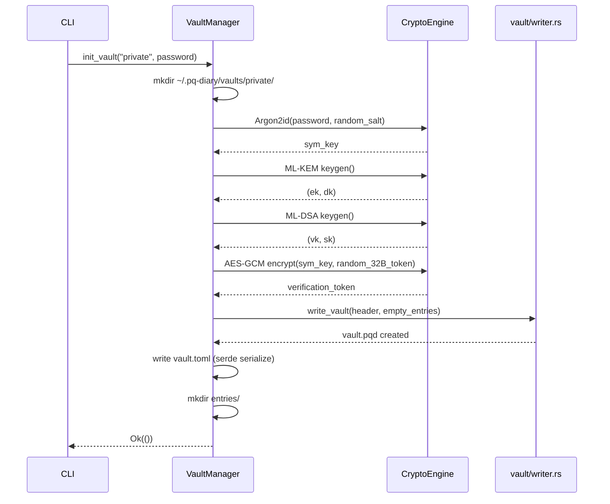
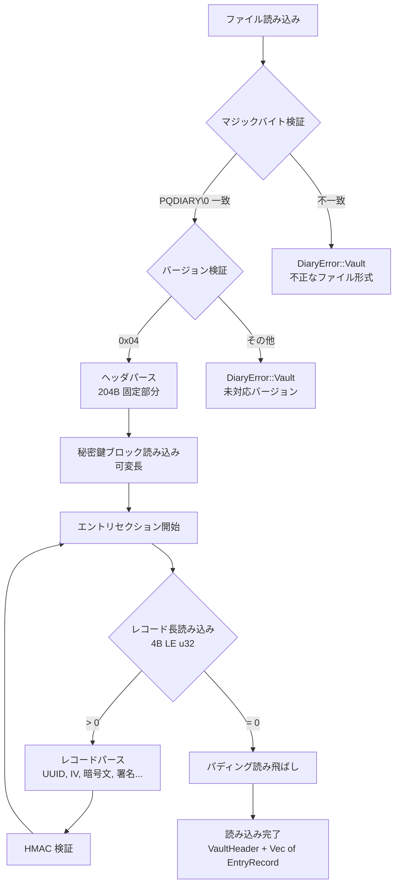
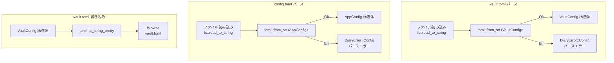
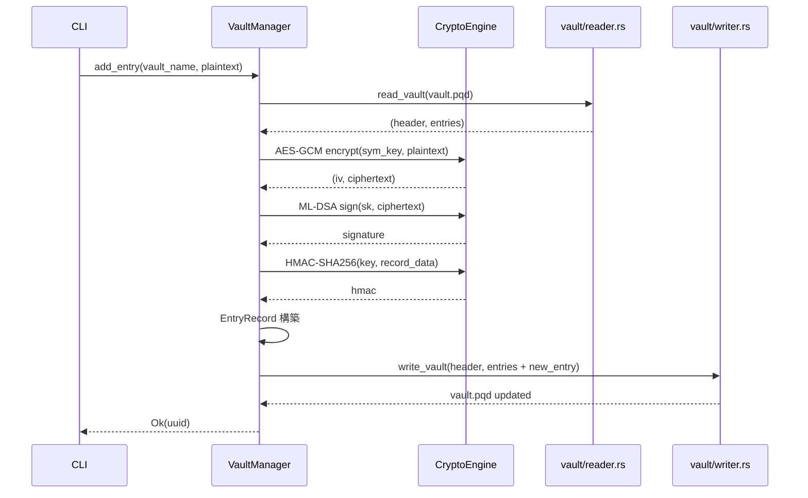

# S3: Vault フォーマット + ストレージ — データフロー図

> **スプリント**: S3 (s3-vault-storage)
> **ステータス**: 全項目 DECIDED

---

## 1. Vault 初期化フロー

CLI から `init` コマンドが呼ばれた際の処理フロー。
VaultManager がディレクトリ作成・鍵生成・ファイル書き出しを統括する。



### 処理ステップ詳細

1. `VaultManager::init_vault()` がディレクトリ `~/.pq-diary/vaults/{name}/` を作成
2. `CryptoEngine` で Argon2id KDF を実行し、パスワードから対称鍵を導出
3. ML-KEM-768 鍵ペア (カプセル化鍵 `ek` / 脱カプセル化鍵 `dk`) を生成
4. ML-DSA-65 鍵ペア (検証鍵 `vk` / 署名鍵 `sk`) を生成
5. ランダム 32 バイトトークンを AES-256-GCM で暗号化し、検証トークンとする
6. `write_vault()` でヘッダ + 空エントリセクション + パディングを vault.pqd に書き出し
7. vault.toml をデフォルト設定で生成
8. `entries/` サブディレクトリを作成

---

## 2. vault.pqd 読み込みフロー

ファイルオープンからヘッダ検証、エントリレコード逐次読み込みまでのフロー。



### エラーハンドリング

| エラー条件 | エラー型 | 説明 |
|-----------|---------|------|
| マジックバイト不一致 | `DiaryError::Vault` | vault.pqd でないファイルを開いた場合 |
| バージョン不一致 | `DiaryError::Vault` | 未対応のスキーマバージョン |
| ヘッダサイズ不足 | `DiaryError::Vault` | ファイルが途中で切れている場合 |
| レコード長異常 | `DiaryError::Vault` | レコード長がファイル残りを超える場合 |
| HMAC 検証失敗 | `DiaryError::Integrity` | レコードが改竄された場合 |

---

## 3. vault.toml / config.toml パースフロー

serde + toml クレートによる設定ファイルの読み書きフロー。



### 設定ファイルパス

| ファイル | パス | 用途 |
|---------|------|------|
| config.toml | `~/.pq-diary/config.toml` | アプリケーション全体設定 (デフォルト Vault、デーモン設定) |
| vault.toml | `~/.pq-diary/vaults/{name}/vault.toml` | Vault 固有設定 (アクセスポリシー、Git 設定、Argon2 パラメータ) |

---

## 4. エントリ追加フロー

新規日記エントリを Vault に追加する際の暗号化・書き込みフロー。



---

## 5. マルチ Vault ディレクトリ構造

```
~/.pq-diary/
  config.toml                          # アプリ全体設定
  vaults/
    private/                           # Vault "private"
      vault.pqd                        # バイナリ Vault ファイル
      vault.toml                       # Vault 設定
      entries/                         # エントリ個別ファイル (将来拡張)
      .git/                            # Git リポジトリ
    work/                              # Vault "work"
      vault.pqd
      vault.toml
      entries/
      .git/
```
