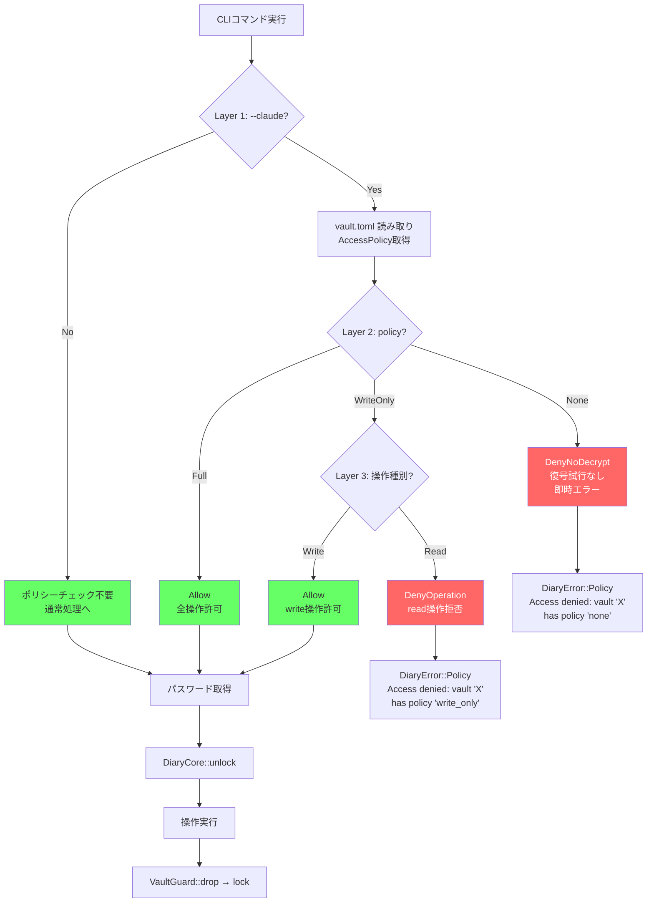
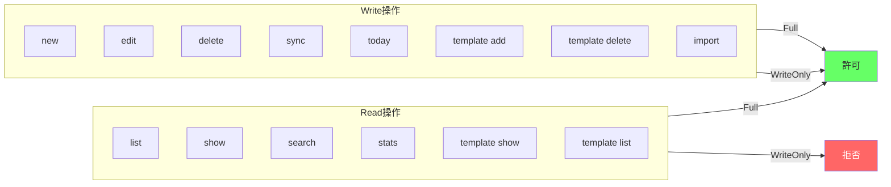
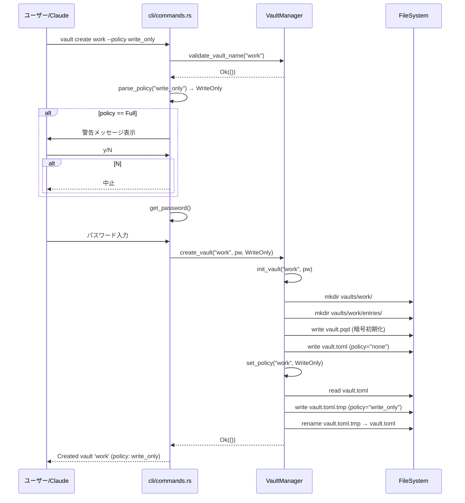
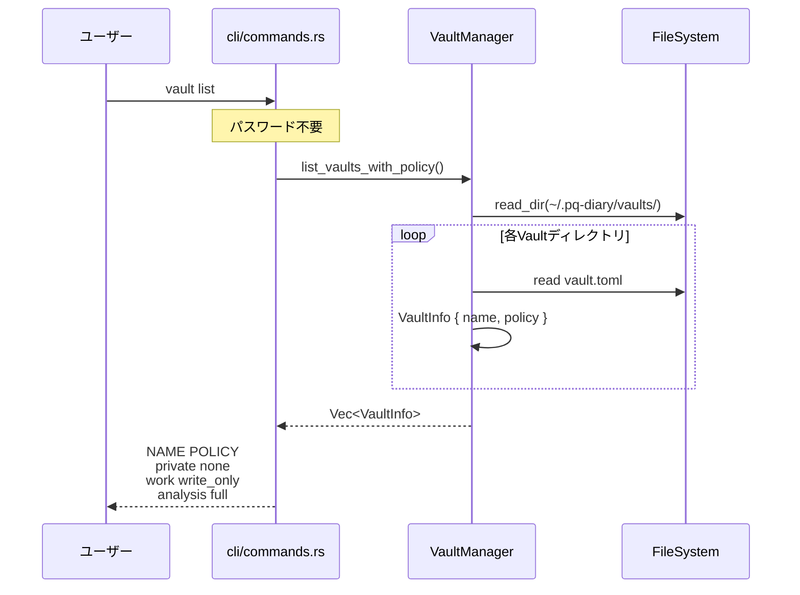
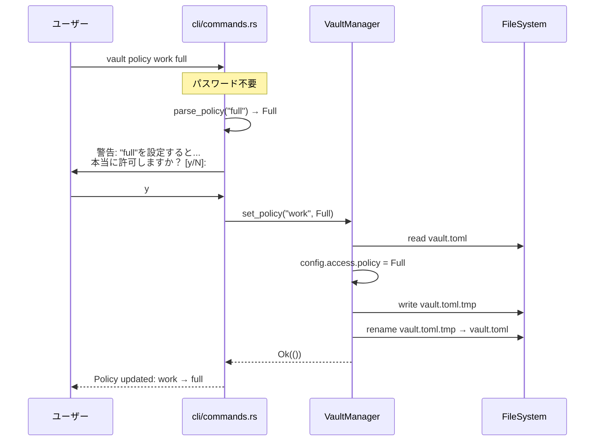
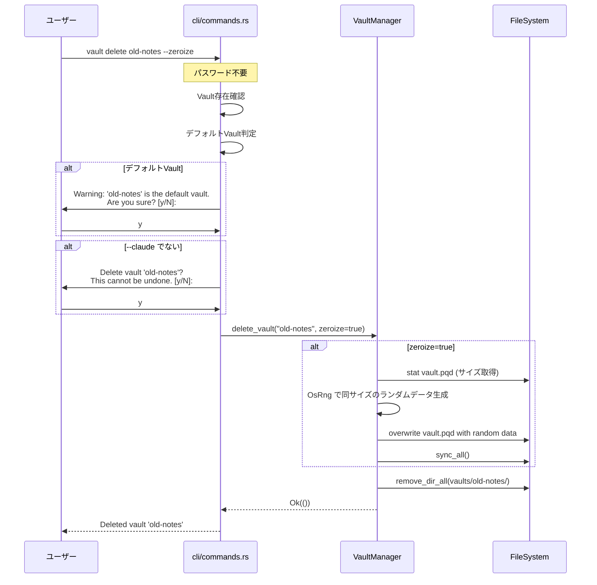
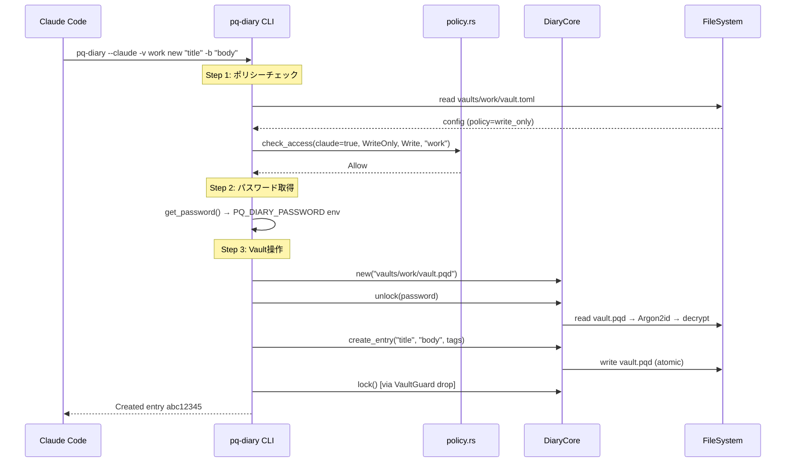

# S7 Access Control + Claude データフロー図

**作成日**: 2026-04-10
**関連アーキテクチャ**: [architecture.md](architecture.md)
**関連要件定義**: [requirements.md](../../spec/s7-access-control-claude/requirements.md)

**【信頼性レベル凡例】**:
- 🔵 **青信号**: EARS要件定義書・設計文書・ユーザヒアリングを参考にした確実なフロー

---

## 4層ポリシーチェックフロー 🔵

**信頼性**: 🔵 *PRD 4.4 + REQ-020〜025*



## 操作分類マッピング 🔵

**信頼性**: 🔵 *REQ-010 + ヒアリングQ8*



## vault create フロー 🔵

**信頼性**: 🔵 *REQ-030〜032, REQ-040*



## vault list フロー 🔵

**信頼性**: 🔵 *REQ-033, REQ-201*



## vault policy フロー 🔵

**信頼性**: 🔵 *REQ-034, REQ-040, REQ-202*



## vault delete フロー 🔵

**信頼性**: 🔵 *REQ-035〜037, REQ-102*



## --claude コマンド実行フロー（全体） 🔵

**信頼性**: 🔵 *REQ-020〜025, REQ-101*



## エラーハンドリングフロー 🔵

**信頼性**: 🔵 *REQ-050, EDGE-001〜006*

```mermaid
flowchart TD
    A[エラー発生] --> B{エラー種別}
    B -->|ポリシー拒否 None| C["DiaryError::Policy<br/>Access denied: vault 'X' has policy 'none'.<br/>'--claude' requires 'write_only' or 'full'."]
    B -->|ポリシー拒否 WriteOnly+Read| D["DiaryError::Policy<br/>Access denied: vault 'X' has policy 'write_only'.<br/>Read operations require 'full'."]
    B -->|Vault名無効| E["DiaryError::InvalidArgument<br/>Invalid vault name: ..."]
    B -->|Vault重複| F["DiaryError::Vault<br/>Vault 'X' already exists"]
    B -->|Vault未存在| G["DiaryError::Vault<br/>Vault 'X' not found"]
    B -->|vault.toml破損| H["DiaryError::Config<br/>Failed to parse vault.toml: ..."]
    B -->|無効ポリシー値| I["DiaryError::Config<br/>unknown variant 'X', expected one of<br/>'none', 'write_only', 'full'"]

    C --> EXIT[exit(1)]
    D --> EXIT
    E --> EXIT
    F --> EXIT
    G --> EXIT
    H --> EXIT
    I --> EXIT
```

## 関連文書

- **アーキテクチャ**: [architecture.md](architecture.md)
- **型定義**: [types.rs](types.rs)
- **要件定義**: [requirements.md](../../spec/s7-access-control-claude/requirements.md)

## 信頼性レベルサマリー

- 🔵 青信号: 全件 (100%)
- 🟡 黄信号: 0件 (0%)
- 🔴 赤信号: 0件 (0%)

**品質評価**: 高品質
