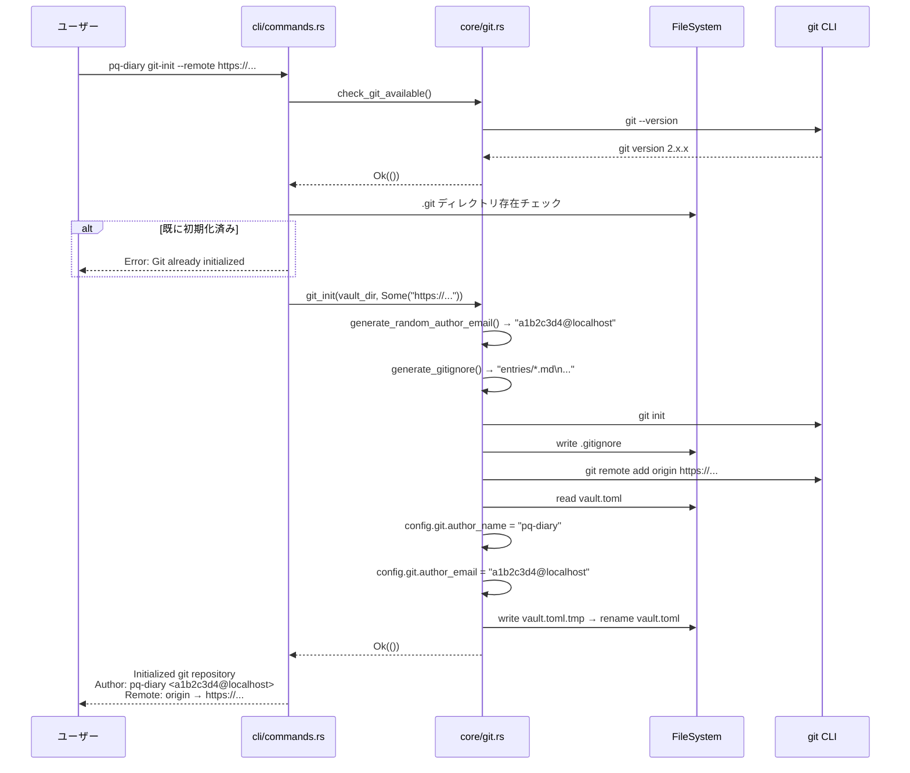
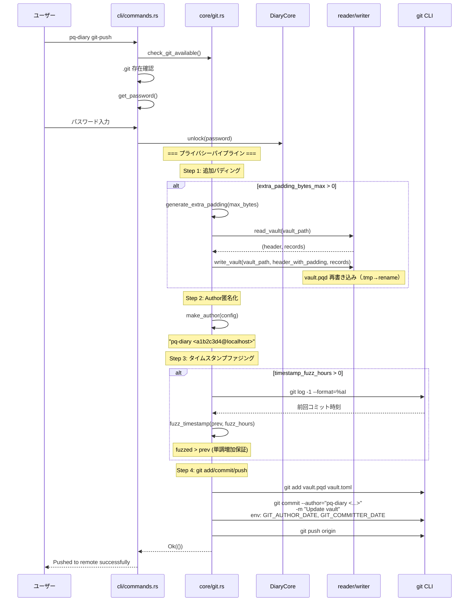
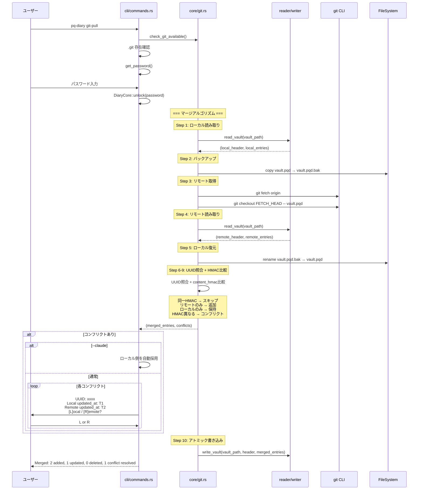
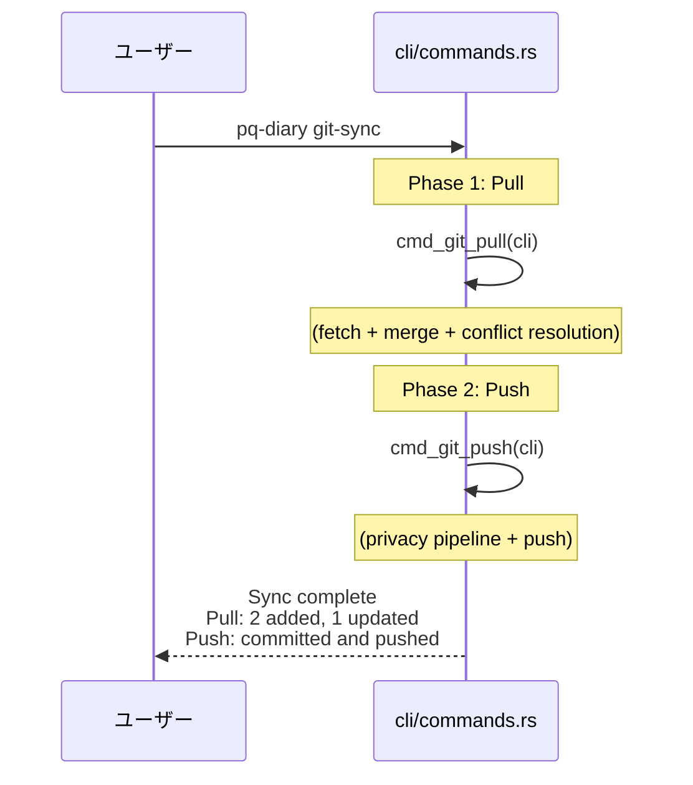
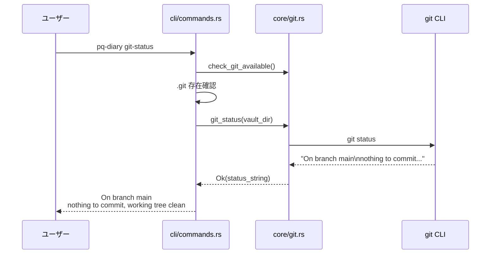
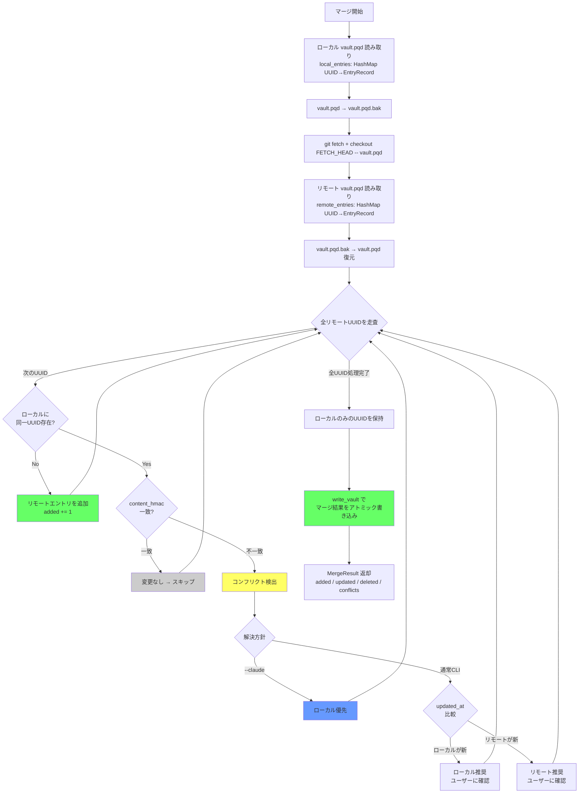
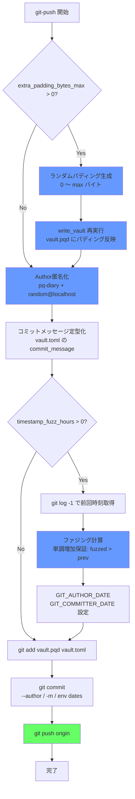
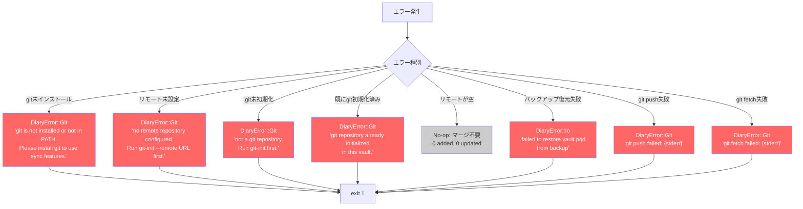

# S8 Git Sync データフロー図

**作成日**: 2026-04-10
**関連アーキテクチャ**: [architecture.md](architecture.md)
**関連要件定義**: [requirements.md](../../spec/s8-git-sync/requirements.md)

**【信頼性レベル凡例】**:
- 🔵 **青信号**: EARS要件定義書・設計文書・ユーザヒアリングを参考にした確実なフロー

---

## git-init フロー 🔵

**信頼性**: 🔵 *REQ-001〜005, EDGE-006*

## git-push フロー（プライバシーパイプライン付き） 🔵

**信頼性**: 🔵 *REQ-010〜017, REQ-050〜054, ADR-0006 + ヒアリングQ1「write_vault()再実行」*

## git-pull + マージフロー 🔵

**信頼性**: 🔵 *REQ-020〜028 + ヒアリングQ2「last-write-wins by updated_at」*

## git-sync フロー 🔵

**信頼性**: 🔵 *REQ-030〜031*

## git-status フロー 🔵

**信頼性**: 🔵 *REQ-040*

## マージアルゴリズム フローチャート 🔵

**信頼性**: 🔵 *REQ-021〜028*

## プライバシーパイプライン フロー 🔵

**信頼性**: 🔵 *REQ-010〜017, ADR-0006*

## エラーハンドリングフロー 🔵

**信頼性**: 🔵 *EDGE-001〜006*

## 関連文書

- **アーキテクチャ**: [architecture.md](architecture.md)
- **型定義**: [types.rs](types.rs)
- **要件定義**: [requirements.md](../../spec/s8-git-sync/requirements.md)

## 信頼性レベルサマリー

- 🔵 青信号: 全件 (100%)
- 🟡 黄信号: 0件 (0%)
- 🔴 赤信号: 0件 (0%)

**品質評価**: 高品質
