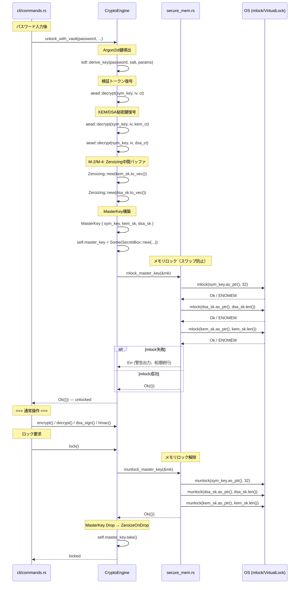
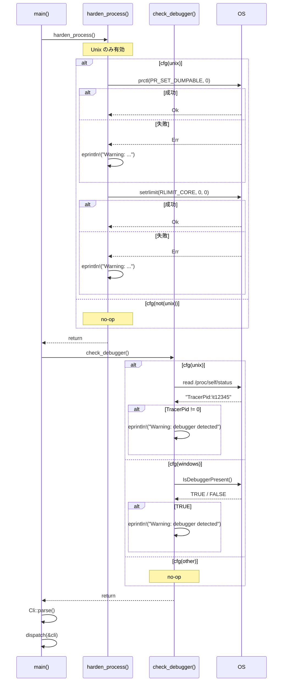
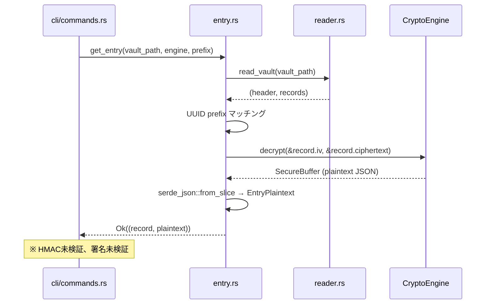
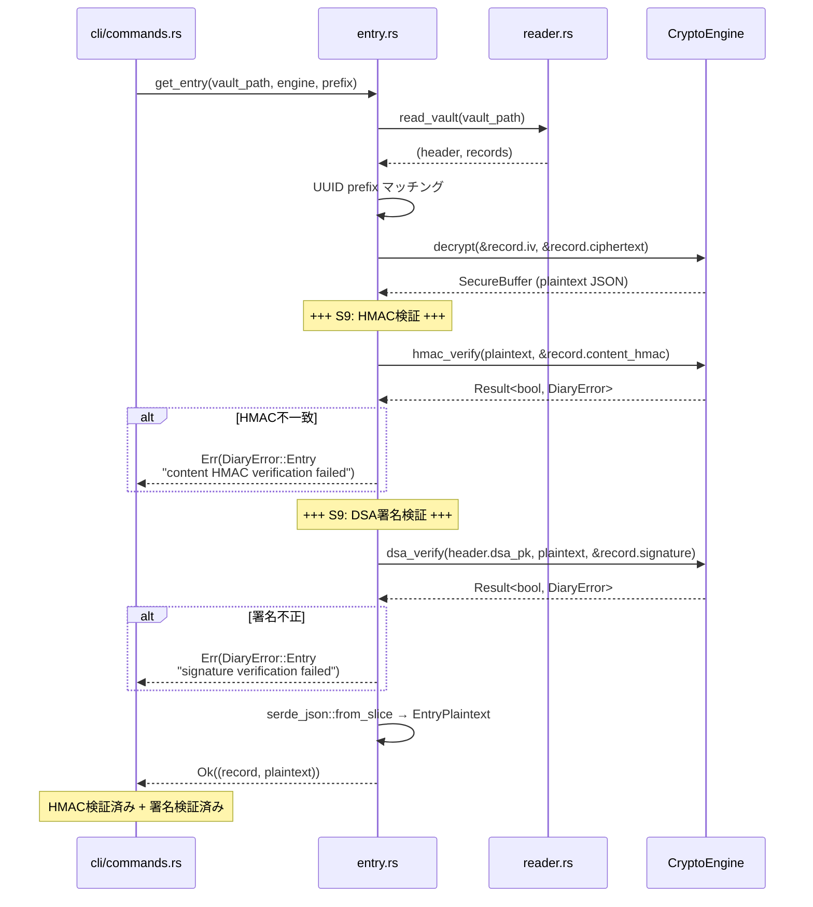
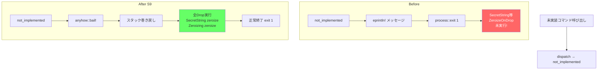
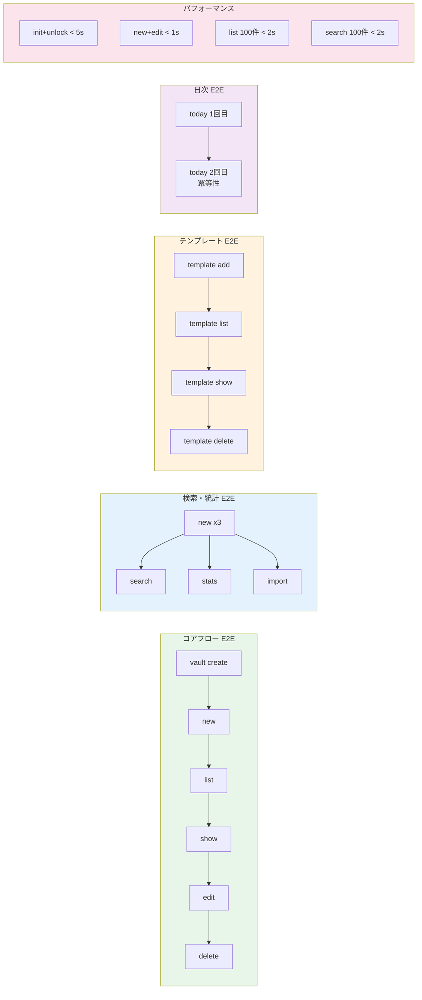

# S9 Security Hardening + Technical Debt データフロー図

**作成日**: 2026-04-10
**関連アーキテクチャ**: [architecture.md](architecture.md)

**【信頼性レベル凡例】**:
- 🔵 **青信号**: 既存実装・CLAUDE.md規約・コードレビュー指摘事項を参考にした確実なフロー

---

## メモリロックライフサイクル 🔵

**信頼性**: 🔵 *既存CryptoEngine unlock/lockフロー + secure_mem.rs構造*



## プロセス硬化フロー 🔵

**信頼性**: 🔵 *nix crate機能 + CLAUDE.md規約*



## デバッガー検出フローチャート 🔵

**信頼性**: 🔵 *プラットフォーム分岐パターン（password.rs #[cfg] 準拠）*

```mermaid
flowchart TD
    START[check_debugger 開始] --> PLATFORM{プラットフォーム判定}

    PLATFORM -->|Unix| READ_PROC[/proc/self/status 読み取り]
    READ_PROC --> PARSE{TracerPid行をパース}
    PARSE -->|読み取り失敗| WARN_READ[eprintln! 警告<br/>処理続行]
    PARSE -->|TracerPid == 0| NO_DEBUG[デバッガーなし<br/>正常続行]
    PARSE -->|TracerPid != 0| WARN_DEBUG_U[eprintln!<br/>'Warning: debugger detected<br/>PID={TracerPid}']

    PLATFORM -->|Windows| IS_DEBUG[IsDebuggerPresent()]
    IS_DEBUG -->|FALSE| NO_DEBUG_W[デバッガーなし<br/>正常続行]
    IS_DEBUG -->|TRUE| WARN_DEBUG_W[eprintln!<br/>'Warning: debugger detected']

    PLATFORM -->|その他| NOOP[no-op]

    WARN_READ --> DONE[return]
    NO_DEBUG --> DONE
    WARN_DEBUG_U --> DONE
    NO_DEBUG_W --> DONE
    WARN_DEBUG_W --> DONE
    NOOP --> DONE

    style WARN_DEBUG_U fill:#ff6
    style WARN_DEBUG_W fill:#ff6
    style NO_DEBUG fill:#6f6
    style NO_DEBUG_W fill:#6f6
```

## エントリ読み取りパス（Before / After） 🔵

**信頼性**: 🔵 *既存entry.rs get_entry()構造 + HMAC/署名検証追加*

### Before（現行）



### After（S9）



## list_entries HMAC検証フロー 🔵

**信頼性**: 🔵 *既存list_entries構造 + パフォーマンス考慮*

```mermaid
flowchart TD
    START[list_entries 開始] --> READ[read_vault<br/>→ header, records]
    READ --> LOOP{各record}

    LOOP -->|次のrecord| TYPE{record_type<br/>== ENTRY?}
    TYPE -->|No| SKIP[スキップ]
    TYPE -->|Yes| DECRYPT[engine.decrypt<br/>→ plaintext]

    DECRYPT --> HMAC{engine.hmac_verify<br/>plaintext vs content_hmac}
    HMAC -->|Ok(true)| DESER[serde_json::from_slice<br/>→ EntryPlaintext]
    HMAC -->|Ok(false)| ERR_HMAC[DiaryError::Entry<br/>'HMAC verification failed']
    HMAC -->|Err| ERR_HMAC2[DiaryError伝播]

    DESER --> META[EntryMeta構築]
    META --> PUSH[metas.push(meta)]
    PUSH --> LOOP

    SKIP --> LOOP
    LOOP -->|全record処理完了| DONE[Ok(metas)]

    style ERR_HMAC fill:#f66,color:#fff
    style ERR_HMAC2 fill:#f66,color:#fff
    style DONE fill:#6f6
```

## H-1 SecretString 化フロー 🔵

**信頼性**: 🔵 *レビュー指摘 H-1 + 既存password.rs構造*

```mermaid
flowchart TD
    START[CLI起動] --> PARSE[Cli::parse<br/>password: Option&lt;SecretString&gt;]
    PARSE --> GET_PW[get_password<br/>flag_value: Option&lt;&SecretString&gt;]

    GET_PW --> FLAG{flag_value<br/>あり?}
    FLAG -->|Yes| EXPOSE[flag.expose_secret<br/>→ &str]
    EXPOSE --> PS_FLAG[PasswordSource::Flag<br/>SecretString]
    FLAG -->|No| ENV{PQ_DIARY_PASSWORD<br/>環境変数あり?}
    ENV -->|Yes| PS_ENV[PasswordSource::Env<br/>SecretString]
    ENV -->|No| TTY{stdin is_terminal?}
    TTY -->|Yes| PS_TTY[PasswordSource::Tty<br/>SecretString]
    TTY -->|No| ERR[DiaryError::Password]

    PS_FLAG --> USE[expose_secret<br/>→ &str → as_bytes]
    PS_ENV --> USE
    PS_TTY --> USE
    USE --> UNLOCK[engine.unlock<br/>password: &[u8]]

    Note over PARSE: String は即座に<br/>SecretString に変換

    style PARSE fill:#69f
    style PS_FLAG fill:#6f6
    style PS_ENV fill:#6f6
    style PS_TTY fill:#6f6
    style ERR fill:#f66,color:#fff
```

## M-1 not_implemented bail! 化フロー 🔵

**信頼性**: 🔵 *レビュー指摘 M-1 + anyhow::bail! パターン*



## E2Eテストカバレッジマップ 🔵

**信頼性**: 🔵 *既存コマンド一覧 + テスト網羅方針*



## 関連文書

- **アーキテクチャ**: [architecture.md](architecture.md)
- **型定義**: [types.rs](types.rs)
- **ヒアリング記録**: [design-interview.md](design-interview.md)

## 信頼性レベルサマリー

- 🔵 青信号: 全件 (100%)
- 🟡 黄信号: 0件 (0%)
- 🔴 赤信号: 0件 (0%)

**品質評価**: 高品質
